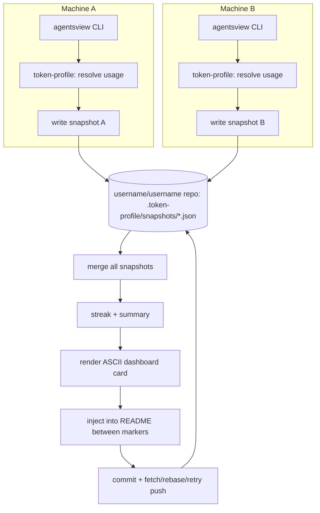

# GitHub Token Profile - Plan

## Goal Capsule

- **Objective:** Ship a reusable CLI that turns local AI coding session data into a GitHub-rendered token-usage profile.
- **Product authority:** This document, produced via `ce-brainstorm` dialogue with the repo owner.
- **Open blockers:** None — implementation-ready.
- **Product Contract preservation:** Unchanged — R1–R12, Actors, Flows, and Acceptance Examples preserved verbatim. The two Outstanding Questions from the brainstorm are resolved into Planning Contract KTDs (see below), not carried forward as open items.
- **Language:** Go — see KTD11 for the full rationale against the Node.js/Python alternatives.

---

## Product Contract

### Summary

A CLI tool, living in this `token-profile` repo, reads local AI coding session data via [agentsview](https://github.com/kenn-io/agentsview) and renders a token-usage profile — headline stats, an [asciigraph](https://github.com/guptarohit/asciigraph) trend line, a streak indicator, and a usage breakdown — into a single ASCII dashboard card written to a `username/username` README. It ships as a reusable tool other GitHub users can adopt for their own profiles, and it merges usage across an adopter's own multiple machines using git itself as the sync layer.

### Problem Frame

The idea started from seeing wakatime-readme-style widgets on other developers' GitHub profiles — dev-stat cards that make coding activity visible on a profile page. No equivalent exists for AI coding agent usage (tokens, cost, which models get used). agentsview already solves local session parsing across 20+ agents, but it's a local-first analytics tool, not a profile widget: it has no cloud API, so the wakatime-readme playbook of "GitHub Action polls a hosted API on a schedule" doesn't transfer directly. The tool has to reconcile "profile widgets normally auto-refresh via the cloud" with "the data this widget needs only ever exists on a developer's own machine."

### Key Decisions

- **Reusable tool, not a personal-only script.** Ships as an installable CLI others can adopt, accepting the extra design and documentation cost that implies, because it matches the widget-adoption pattern that inspired it.
- **Local CLI driven by user-run/cron, not a GitHub Action.** agentsview only reads local session directories, so there is no cloud API an Action runner could poll. The tool runs on whichever machine holds the data.
- **Git-native snapshot merge for multi-machine support.** Each machine's run commits a small per-machine snapshot into the repo that hosts the rendered profile; any run reads all committed snapshots and merges them. Git itself is the sync layer, so adopters need no extra service, account, or hosting.
- **Per-model breakdown by default, configurable to per-tool or combined.** Keeps the default profile compact while still letting adopters see the tool dimension agentsview tracks (the same model can be used through different agents).
- **Dashboard-card layout.** The profile renders as one bordered ASCII box containing the summary, trend graph, streak indicator, and breakdown, rather than stacked sections or a two-column layout.
- **One-command setup scaffolding ships in v1.** An init-style command wires up README markers, a scheduling entry, and the first commit, since setup friction is the main lever on adoption. This is a best-judgment default the user did not explicitly confirm — worth a second look before planning locks it in.
- **The rendered profile always shows a "last updated" timestamp.** Refresh depends on someone actually running the CLI, so staleness must be visible rather than silent. This is an assumption, not something discussed directly — flag if unwanted.

### Actors

- A1. **Adopter** — a developer who installs the CLI and runs it, manually or via their own cron/launchd, to keep their `username/username` profile updated.
- A2. **Profile Visitor** — anyone viewing a rendered `username/username` README on GitHub; passive, sees the ASCII dashboard card.

### Requirements

**Data & Sync**

- R1. The CLI resolves local token/usage data via agentsview for the machine it runs on.
- R2. Each run writes or updates a per-machine snapshot committed into the repo that hosts the rendered profile.
- R3. Each run reads all committed per-machine snapshots and merges them into aggregate totals before rendering.
- R4. Merged totals are computed from the session timestamps recorded inside each snapshot, not from when the snapshot file was last committed, so a machine that stops updating doesn't distort trend or streak data or get dropped from historical totals.

**Content & Rendering**

- R5. The rendered profile includes a headline usage summary (total tokens and estimated cost) over a defined trailing window, with an asciigraph trend line over the same window.
- R6. The profile includes a streak/activity indicator reflecting how many of the recent days had recorded usage.
- R7. The profile includes a usage breakdown defaulting to per-model grouping.
- R8. The profile renders as a single bordered ASCII dashboard card containing the summary, trend graph, streak indicator, and breakdown.
- R9. The profile displays a "last updated" timestamp reflecting when the rendering CLI run last completed.

**Setup & Distribution**

- R10. The CLI ships with a documented manual setup path (README markers + scheduling instructions) for adopters who don't use the init flow.
- R11. The CLI provides a one-command init flow that scaffolds the README markers, a scheduling entry, and performs the first commit/push.

**Configuration**

- R12. Adopters can configure the breakdown view mode (per-model, per-tool, or combined) independent of the default.

### Key Flows

- F1. **Solo adopter refresh**
  - **Trigger:** Adopter manually runs the CLI, or their scheduled cron/launchd job fires.
  - **Actors:** A1
  - **Steps:** CLI resolves local usage via agentsview; writes/updates this machine's snapshot; reads all snapshots in the repo; merges and renders the profile card; commits and pushes.
  - **Covers:** R1, R2, R3, R5, R6, R7, R8, R9

- F2. **Multi-machine merge**
  - **Trigger:** Adopter runs the CLI on a second (or third) machine for the first time.
  - **Actors:** A1
  - **Steps:** CLI resolves local usage via agentsview on that machine; writes a new per-machine snapshot alongside existing ones; pulls the latest snapshots from the repo; merges all snapshots — including any from machines not recently updated — into aggregate totals; renders and pushes the updated profile.
  - **Covers:** R2, R3, R4

- F3. **First-time setup**
  - **Trigger:** A new adopter runs the init command.
  - **Actors:** A1
  - **Steps:** CLI scaffolds README markers in the target `username/username` repo, writes a scheduling entry, performs an initial run and commit.
  - **Covers:** R10, R11

### Acceptance Examples

- AE1. **Covers R7, R12.** Given an adopter has not changed the breakdown config, when the profile renders, then the breakdown section groups usage by model only.
- AE2. **Covers R4.** Given a machine's snapshot hasn't been updated in over 30 days, when another machine's run merges snapshots, then that machine's historical totals are still included in the merged aggregate and its inactivity does not zero out or drop its prior contribution.
- AE3. **Covers R9.** Given the CLI last completed a run 10 days ago, when a visitor views the profile, then the "last updated" timestamp visibly reflects that gap rather than presenting the data as current.

### Scope Boundaries

**Deferred for later**

- GitHub Action-based auto-refresh — revisit if agentsview or an equivalent tool ever exposes an endpoint a hosted Action runner could reach.
- Additional profile content blocks beyond the four in v1 (e.g., an activity heatmap grid, badges).

**Outside this product's identity**

- A general usage-analytics or team-leaderboard dashboard — the tool stays a README-snippet generator, not a competitor to agentsview.
- Team/org-wide reporting or centralized sync backends (e.g., agentsview's Postgres/DuckDB + S3-compatible sync) as the primary mechanism.

### Dependencies / Assumptions

- Depends on agentsview remaining available and able to read the session formats of whichever coding agents the adopter uses.
- Depends on asciigraph, or an equivalent ASCII chart renderer, for the trend graph.
- Assumes the adopter has push access to the repo hosting the rendered profile from every machine they run the CLI on.
- Assumes a scheduling mechanism (cron/launchd, or a manual habit) is available on at least one of the adopter's machines; the tool does not provide its own always-on scheduler.

### Outstanding Questions

Both questions deferred from the brainstorm are resolved during planning: trailing window length (Planning Contract KTD10) and snapshot naming / machine-identity scheme (KTD4, KTD6).

### Success Criteria

- The adopter (repo owner) keeps using it personally — their own profile stays updated and they're still glad it's there months in.
- At least some other GitHub users adopt it for their own profiles (visible via stars, forks, or the widget appearing on profiles other than the original adopter's).
- Both signals matter roughly equally; neither alone is treated as sufficient.

---

## Planning Contract

### Key Technical Decisions

- KTD1. **Shell out to the `agentsview` CLI; don't vendor or reimplement session parsing.** agentsview (Go, ~40 supported agents) is a full application, not an importable library — the tool execs `agentsview usage daily --json --breakdown --offline [--agent <name>] [--since <date>]` and validates the binary is on `PATH` before every run, failing with an actionable error (not a raw exec error) when it's missing.
- KTD2. **No local caching layer.** agentsview does its own on-demand session sync and answers windowed JSON queries in well under a second (benchmarked ~0.53s for a 22k-session DB with `--offline`), so the tool calls it fresh on every run instead of maintaining a separate cache.
- KTD3. **Per-model and per-tool breakdowns both derive from per-agent-filtered calls.** `--agent` filters the underlying message scan before aggregation, and each message belongs to exactly one agent — so `agentsview usage daily --json --breakdown --agent <name>`, called once per active agent and summed, reconstructs the same per-model totals as one unfiltered call, just with the agent dimension preserved. Active agents are enumerated from `agentsview session list` (paginated, distinct `agent` values) — there is no dedicated "list agents" CLI command; the undocumented `GET /api/v1/agents` HTTP endpoint would require running `agentsview serve` as a background daemon, which the tool avoids (see KTD2).
- KTD4. **Snapshots store full daily+agent+model rows, not pre-aggregated totals.** Each machine's snapshot is its complete local history at that granularity, so merging never needs to re-query agentsview on a machine other than the one currently running, and re-deriving streak/summary after a new machine joins stays accurate.
- KTD5. **Snapshot dates are normalized to UTC before storage.** agentsview buckets daily data by local `--timezone`; storing UTC dates keeps merges correct when an adopter's machines sit in different timezones.
- KTD6. **Machine identity is a random ID cached locally, not derived from hostname.** Generated once on first run and cached at `~/.token-profile/machine-id`, avoiding collisions between machines that happen to share a hostname (e.g. two machines both named "MacBook-Pro").
- KTD7. **README section is delimited by HTML comment markers** (`<!-- token-profile:start -->` / `<!-- token-profile:end -->`), following the convention used by comparable profile-widget tools. The tool replaces only the content between markers and fails with an actionable error if markers are missing, rather than guessing an insertion point.
- KTD8. **Git pushes use fetch + rebase + bounded retry.** Concurrent pushes from an adopter's own multiple machines are an expected case, not an exceptional one, so a rejected push triggers a fetch-rebase-retry loop before surfacing a failure.
- KTD9. **Distribution via GoReleaser**, producing per-OS/arch binaries and checksums — the same pattern agentsview and asciigraph both use for their own releases (curl-install script and/or `go install`).
- KTD10. **Trailing window defaults to agentsview's own default (30 days, via an omitted `--since`)**, configurable through the tool's own config/flag, resolving the brainstorm's deferred window-length question with the simplest option: don't diverge from the upstream default.
- KTD11. **Go over Node.js or Python for the tool itself.** Both alternatives were real options: Node.js has the `asciichart` npm sibling package, Python has `asciichartpy` on PyPI, and either could shell out to `agentsview` just as well as Go can. Go wins on three points: it needs no runtime beyond `agentsview` itself (which is also Go) — Node/Python would add a *second* required runtime on top of that; it distributes as a single static binary via GoReleaser, matching the exact install pattern adopters already need for `agentsview` and that `asciigraph` itself uses; and it imports `github.com/guptarohit/asciigraph` directly as a library, giving access to formatter options (date-aware axis labeling) that the CLI-only sibling ports may not replicate.
- KTD12. **Every agentsview invocation in a single run passes `--offline`.** Live pricing is fetched from the LiteLLM catalog on each invocation by default; without `--offline`, separate per-agent calls within the same run could each see a slightly different price snapshot, making summed per-agent costs drift from what a single unfiltered call would show. `--offline` pins all calls in a run to the same embedded rate table.

### High-Level Technical Design



Git itself is the only sync layer between machines — there is no server, queue, or shared database. Each machine only ever reads/writes the repo it already has push access to.

### Risks & Dependencies

- **agentsview's usage/cost reporting is explicitly labeled "Experimental" upstream**, despite `usage daily --json`'s schema being documented as stable and additive. Mitigation: pin tested version ranges in the tool's own docs, and decode defensively (ignore unknown JSON fields, per agentsview's own guidance).
- **The per-agent-sum-equals-unfiltered-total equivalence behind KTD3 is inferred from documented filter/aggregation mechanics, not an explicitly documented guarantee.** Mitigation: `--offline` (KTD12) removes the pricing-drift variable; U2's tests should still cross-check a summed multi-agent result against one unfiltered call on real fixture data before relying on it.
- **Concurrent multi-machine pushes can still fail after the bounded retry count** under heavy contention — surfaced as a clear error, never silent data loss, but not eliminated entirely.
- **Snapshot files grow without bound** (no compaction in v1) — acceptable at expected personal/multi-machine scale, deferred as follow-up work if repo size becomes a real problem.
- Depends on `agentsview` and `asciigraph` remaining available and API-stable; both are third-party OSS outside this project's control (carried from Product Contract Dependencies).

### Open Questions

**Deferred to Implementation**

- Snapshot compaction/rotation strategy for long-term repo growth — not needed for v1, revisit if it becomes a real problem.

---

## Output Structure

```text
token-profile/
  cmd/
    token-profile/
      main.go
  internal/
    agentsview/
      client.go        # shells out to `agentsview`, decodes JSON
      resolve.go        # per-agent calls -> unified (date, agent, model) dataset
      client_test.go
      resolve_test.go
    snapshot/
      snapshot.go        # read/write this machine's snapshot
      merge.go            # merge all snapshots in the target repo
      snapshot_test.go
    machineid/
      machineid.go        # generate/cache machine identity
      machineid_test.go
    summary/
      summary.go           # trailing-window totals + streak
      summary_test.go
    render/
      render.go             # ASCII dashboard-card rendering (asciigraph)
      render_test.go
    readme/
      inject.go              # marker detection + section replace
      inject_test.go
    gitops/
      gitops.go                # commit / fetch-rebase-retry push
      gitops_test.go
    config/
      config.go                 # config schema + loading
      config_test.go
    cli/
      run.go                     # `token-profile run`
      init.go                     # `token-profile init`
      run_test.go
      init_test.go
  .goreleaser.yml
  go.mod
```

---

## Implementation Units

### U1. Project scaffolding, config, and agentsview client

- **Goal:** Set up the Go module, CLI command scaffolding, config loading, and an agentsview client wrapper that shells out to the `agentsview` binary.
- **Requirements:** R1
- **Dependencies:** none
- **Files:** `go.mod`, `cmd/token-profile/main.go`, `internal/config/config.go`, `internal/config/config_test.go`, `internal/agentsview/client.go`, `internal/agentsview/client_test.go`
- **Approach:** Config loads target-repo path, breakdown view mode, trailing window, and machine-id path, with defaults matching KTD10. The client execs `agentsview usage daily --json --breakdown --offline [--agent <name>] [--since <date>]` via `os/exec` and decodes into a Go struct matching the documented `daily[]`/`totals` schema.
- **Patterns to follow:** n/a — greenfield project.
- **Test scenarios:**
  - Happy path: a well-formed `agentsview usage daily --json --breakdown` fixture decodes into the expected struct.
  - Edge case: response JSON contains unrecognized extra fields — decoding ignores them without failing (matches agentsview's "additive, ignore unknown keys" guidance).
  - Error path: `agentsview` binary missing from `PATH` — client returns a specific "agentsview not installed" error, not a raw exec error.
  - Error path: `agentsview` exits non-zero — client surfaces stderr content in the returned error.
- **Verification:** `go build ./...` succeeds; `go test ./internal/config/... ./internal/agentsview/...` passes.

### U2. Per-agent/per-model usage resolution

- **Goal:** Resolve usage across all active agents with both per-model and per-tool grouping derivable from one unified dataset.
- **Requirements:** R1, R7, R12
- **Dependencies:** U1
- **Files:** `internal/agentsview/resolve.go`, `internal/agentsview/resolve_test.go`
- **Approach:** Enumerate active agents from `agentsview session list` (paginated, distinct `agent` values — there's no dedicated list-agents command). Call `usage daily --json --breakdown --offline --agent <agent>` once per active agent and combine into an in-memory dataset keyed by (date, agent, model), so per-model, per-tool, and combined views are all derivable by summing along different axes (KTD3, KTD12).
- **Test scenarios:**
  - Happy path: two agents with distinct models resolve into correct per-model totals (summed across agents) and per-tool totals (summed across models within an agent).
  - Integration: on fixture data, the sum of all per-agent calls matches one unfiltered `usage daily --json --breakdown --offline` call for the same window (validates the KTD3 equivalence assumption flagged in Risks & Dependencies).
  - Edge case: an agent with zero usage in the window is omitted, not represented as a zero row.
  - Edge case: the same model name appears under two agents — per-model view sums both, per-tool view keeps them separate.
  - Edge case: `session list` pagination — more than 500 sessions (the documented per-page max) still yields the complete distinct-agent set across multiple pages via `--cursor`.
- **Verification:** `go test ./internal/agentsview/...` passes with fixture-based table tests covering the grouping matrix.

### U3. Snapshot read/write and multi-machine merge

- **Goal:** Persist this machine's resolved usage as a per-machine snapshot and merge all snapshots present in the target repo into aggregate totals.
- **Requirements:** R2, R3, R4
- **Dependencies:** U1, U2
- **Files:** `internal/snapshot/snapshot.go`, `internal/snapshot/merge.go`, `internal/snapshot/snapshot_test.go`, `internal/machineid/machineid.go`, `internal/machineid/machineid_test.go`
- **Approach:** `snapshot.go` writes/reads `<target-repo>/.token-profile/snapshots/<machine-id>.json` with full daily+agent+model rows in UTC (KTD4, KTD5). `machineid.go` generates and caches a random ID at `~/.token-profile/machine-id` (KTD6). `merge.go` unions all snapshot files' daily rows by (date, agent, model), overwriting only same-machine same-day rows on re-run — never double-counting distinct machines.
- **Test scenarios:**
  - Happy path: two machines' snapshots merge into correct combined daily totals.
  - Edge case (Covers AE2): a snapshot untouched for 40+ days still contributes its historical rows to the merge.
  - Edge case: a machine re-runs on the same UTC day — its own same-day row is overwritten, not summed, so re-running doesn't inflate totals.
  - Error path: a snapshot file fails to parse (corrupted/partial write) — merge skips it with a logged warning rather than aborting the run.
- **Verification:** `go test ./internal/snapshot/... ./internal/machineid/...` passes.

### U4. Streak and summary computation

- **Goal:** Derive the headline usage summary and streak/activity indicator from merged snapshot data.
- **Requirements:** R5, R6
- **Dependencies:** U3
- **Files:** `internal/summary/summary.go`, `internal/summary/summary_test.go`
- **Approach:** Compute trailing-window totals (tokens, estimated cost) and a consecutive-day streak by walking merged daily rows backward from today (UTC) until a gap is found; a day counts as active if any merged row has usage that UTC date.
- **Test scenarios:**
  - Happy path: 12 consecutive active days followed by a gap yields a streak of 12.
  - Edge case: today has no data yet — streak counts backward from yesterday, doesn't break on today's absence.
  - Edge case: first-ever run with a single day of data — summary and streak both reflect that one day without erroring on empty history.
- **Verification:** `go test ./internal/summary/...` passes.

### U5. ASCII dashboard-card rendering

- **Goal:** Render the merged summary, trend graph, streak, and breakdown into the single bordered ASCII dashboard card (KD "Dashboard-card layout", R8).
- **Requirements:** R5, R6, R7, R8, R9, R12
- **Dependencies:** U2, U4
- **Files:** `internal/render/render.go`, `internal/render/render_test.go`
- **Approach:** Import `github.com/guptarohit/asciigraph` directly as a Go library (not its CLI) for the trend line, using its formatter options for date-aware axis labeling. Compose the summary line, graph, streak line, and breakdown block inside a fixed-width bordered box, matching the confirmed dashboard-card layout (single bordered ASCII box with summary, trend graph, streak, and breakdown — see Key Decisions). Breakdown content switches on the configured view mode (R12). Appends the "last updated" render timestamp (R9).
- **Test scenarios:**
  - Happy path: default config renders a card with all four blocks in the confirmed layout order.
  - Covers AE1: default (unchanged) config renders a per-model-only breakdown.
  - Edge case: per-tool and combined view modes each render distinct breakdown content from the same underlying merged data.
  - Covers AE3: a stale "last updated" timestamp (10+ days old) renders visibly, not silently as current.
  - Edge case: zero-usage history (first run) renders a "no data yet" state rather than an empty or malformed graph.
- **Verification:** `go test ./internal/render/...` passes; golden-file comparison of rendered output for at least one fixture dataset.

### U6. README marker injection and git publish

- **Goal:** Replace the marked section of the target repo's README with the rendered card and publish via git, handling concurrent-push contention.
- **Requirements:** R2, R9
- **Dependencies:** U3, U5
- **Files:** `internal/readme/inject.go`, `internal/readme/inject_test.go`, `internal/gitops/gitops.go`, `internal/gitops/gitops_test.go`
- **Approach:** `inject.go` finds `<!-- token-profile:start -->` / `<!-- token-profile:end -->` markers (KTD7) and replaces only the content between them. `gitops.go` stages the snapshot file and README, commits, and pushes with fetch + rebase + bounded retry (KTD8).
- **Test scenarios:**
  - Happy path: README with existing markers has its section replaced, content outside markers untouched.
  - Error path: README has no markers — injection fails with an actionable error pointing to the init command.
  - Edge case: push rejected due to a concurrent update — retry loop fetches, rebases, and succeeds on retry (simulate with a local bare-repo fixture).
  - Error path: push still fails after the bounded retry count — surfaces a clear error rather than losing the local commit.
- **Verification:** `go test ./internal/readme/... ./internal/gitops/...` passes, including a git-fixture-based concurrent-push test.

### U7. `run` command wiring

- **Goal:** Wire U1–U6 into the `token-profile run` command — the end-to-end refresh flow (F1, F2).
- **Requirements:** R1, R2, R3, R4, R5, R6, R7, R8, R9
- **Dependencies:** U1, U2, U3, U4, U5, U6
- **Files:** `internal/cli/run.go`, `internal/cli/run_test.go`
- **Approach:** Sequences resolve → snapshot write → merge → summarize → render → inject → publish, surfacing each stage's errors with enough context to act on.
- **Test scenarios:**
  - Integration (Covers F1): end-to-end run against fixture agentsview output and a local git fixture repo produces a committed, pushed README update.
  - Integration (Covers F2): a second simulated machine's run merges cleanly with the first's existing snapshot.
- **Verification:** `go test ./internal/cli/...` passes; manual smoke run against a real local git fixture.

### U8. `init` command

- **Goal:** One-command setup — scaffold README markers, a scheduling entry, and perform the first run (R10, R11, F3).
- **Requirements:** R10, R11
- **Dependencies:** U6, U7
- **Files:** `internal/cli/init.go`, `internal/cli/init_test.go`
- **Approach:** Inserts markers into the target repo's README if absent (idempotent), writes a platform-detected cron/launchd entry, and invokes the U7 run flow once for the first commit. Also documents the manual setup path (R10) for adopters who skip init.
- **Test scenarios:**
  - Happy path: fresh README with no markers gets markers inserted and a first run committed.
  - Edge case: re-running init on an already-initialized repo is a no-op for markers, doesn't duplicate the scheduling entry.
  - Error path: target repo path not configured — init fails with a clear prompt rather than guessing a location.
- **Verification:** `go test ./internal/cli/...` passes; manual run of `token-profile init` against a scratch repo.

---

## Verification Contract

| Command | Applies to | Gate |
|---|---|---|
| `go build ./...` | All units | Build must succeed |
| `go vet ./...` | All units | No vet warnings |
| `go test ./...` | All units | All unit and fixture-based integration tests pass |
| Manual smoke: `token-profile init` then `token-profile run` against a scratch local git repo | U6, U7, U8 | Rendered card matches the confirmed dashboard-card layout; re-run leaves markers intact and updates content |

---

## Definition of Done

- All 8 implementation units (U1–U8) merged.
- `go build ./...`, `go vet ./...`, and `go test ./...` all pass.
- Manual smoke test (init + run against a scratch repo) produces a correctly rendered, pushed README update, and a second simulated machine merges cleanly (F2).
- The KTD3 grouping-semantics open question is resolved one way or the other in the merged code — no dead-end aggregation approach left behind from exploring it.
- The tool's own README documents: the `agentsview` prerequisite and install link, the manual setup path (R10), the config file schema, and the Scope Boundaries non-goals, so adopters aren't surprised.

---

## Documentation / Operational Notes

- Distribution via GoReleaser (`.goreleaser.yml`) producing per-OS/arch binaries and checksums, mirroring agentsview's and asciigraph's own release pattern (KTD9); installable via a curl script and/or `go install github.com/<org>/token-profile/cmd/token-profile@latest`.
- The tool's README states the `agentsview` prerequisite explicitly and links its install instructions, since token-profile cannot function without it on `PATH`.

---

## Sources / Research

- agentsview CLI commands, JSON schema, config, and install methods — researched directly against the repo's docs (`docs/commands.md`, `docs/configuration.md`, `docs/token-usage.md`, `docs/session-api.md`) and `scripts/install.sh`, https://github.com/kenn-io/agentsview.
- asciigraph CLI flags, Go library/CLI split, and install methods — researched against the repo's README and `.goreleaser.yml`, https://github.com/guptarohit/asciigraph. Sibling ports found but unused in this plan: `asciichart` (npm), `asciichartpy` (PyPI).
- agentsview agent-enumeration and `--breakdown` aggregation mechanics (KTD3, KTD12) — confirmed against `docs/session-api.md` ("Shared metadata endpoints", session list pagination) and `docs/token-usage.md` ("How Costs Are Computed", "Pricing Source"), https://github.com/kenn-io/agentsview. No CLI command lists agents; `GET /api/v1/agents` exists but is undocumented in shape and requires a running `agentsview serve` daemon, so U2 uses `session list` pagination instead.
