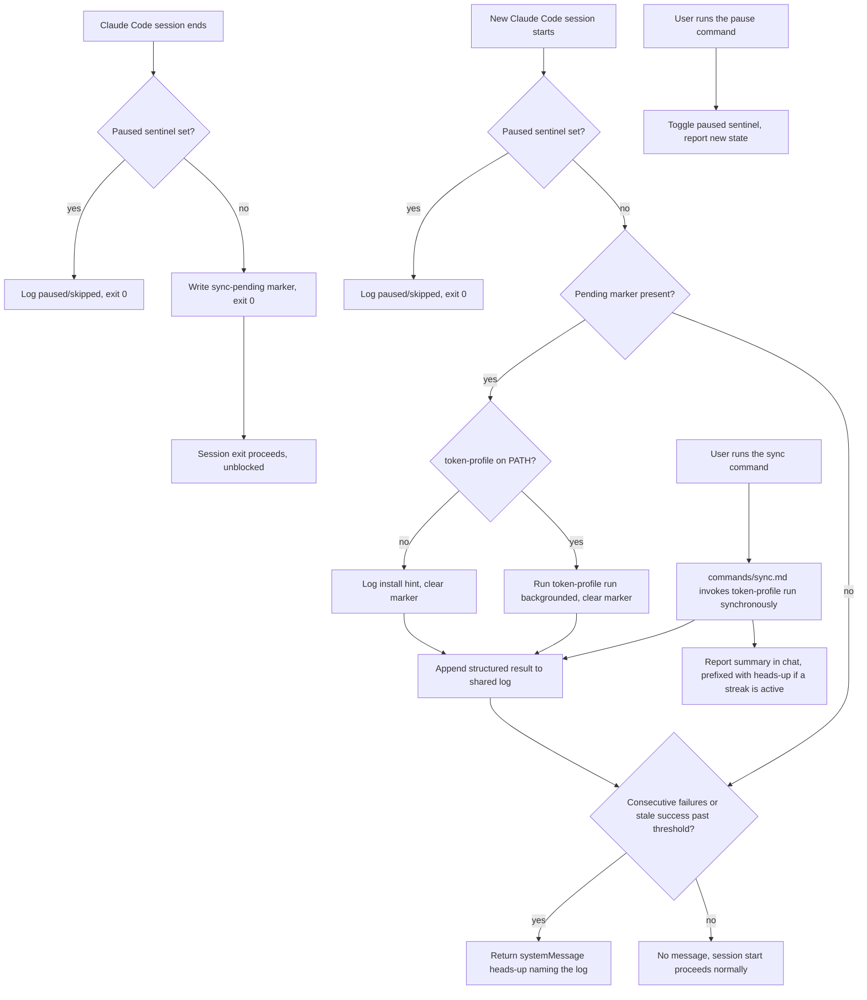

# token-profile Claude Code Plugin - Plan

## Goal Capsule

- **Objective:** Bundle `token-profile` as a Claude Code plugin so its README sync runs automatically and reliably across sessions, or on demand via a slash command — without the user ever touching the raw CLI.
- **Product authority:** This plan's own Product Contract below (bootstrap-sourced — no existing brainstorm covered plugin distribution specifically).
- **Open blockers:** On hold — see Outstanding Questions. The Planning Contract, Implementation Units, Verification Contract, and Definition of Done below are already drafted and stay intact for fast resumption, but the plan is not implementation-ready until the blocking question is resolved.
- **Depends on:** `docs/plans/2026-07-03-001-feat-github-token-profile-plan.md` (the `token-profile` CLI and its `run`/`init` commands). That plan is treated as upstream context here, not modified by this one.
- **Distribution surface:** A Claude Code plugin — manifest, hook registration, and slash commands — that shells out to the already-built CLI binary. No new compiled code.

---

## Product Contract

### Summary

`token-profile`'s CLI (from the origin plan) requires a user to remember to run `token-profile run`. This plan adds a Claude Code plugin that wraps that CLI with two invocation surfaces: an automatic sync that runs across every session boundary, and a `/token-profile:sync` slash command for on-demand syncs. Both surfaces install in one step via Claude Code's plugin system, with no manual `settings.json` editing required.

### Key Decisions

- Package as a Claude Code **plugin**, not a bare skill — only a plugin's `hooks/hooks.json` auto-registers a hook on install; a skill has no hook-registration mechanism of its own.
- Bundle the plugin inside this same `token-profile` repo, in a dedicated `claude-plugin/` subdirectory, rather than a separate repo.
- Sync is triggered **unconditionally on every session boundary**, with no debounce — an explicit choice made during scoping, accepted with the understanding that it increases exposure to the origin plan's unresolved git-push race (see Risks & Dependencies).
- `SessionEnd` does not perform the sync itself. A documented Claude Code issue shows `SessionEnd` subprocesses — including backgrounded ones — can be killed before completing, which would silently defeat a design that tries to do the real work there. Instead, `SessionEnd` only writes a fast "sync pending" marker, and the actual sync runs at the next `SessionStart`, when the session is reliably alive.
- No per-invocation approval gate before a sync runs. This is an explicit non-goal, not an oversight: the action is self-owned (the user's own profile repo), idempotent (safe to rerun), and reversible (`git revert`), and the user already opted in by installing the plugin. An approval prompt on every session boundary would defeat the plugin's entire purpose.
- Because syncs can now be silently skipped or fail without an interactive turn to report through, the plugin escalates via a one-time-per-session heads-up at the next `SessionStart` after failures repeat past a threshold, and offers a pause/resume control so the user has a lever short of uninstalling.
- The hook, the catch-up sync, and the slash command all share one log file so every path is troubleshootable from the same place.

### Actors

- A1. Adopter with the plugin installed — receives automatic sync across session boundaries with no explicit action, and may see an escalation heads-up if syncs have been failing.
- A2. Adopter invoking sync directly — runs `/token-profile:sync` on demand and waits for a result.

### Requirements

**Packaging & Distribution**
- R1. The plugin installs via a git-based marketplace source pointing at this repo (`/plugin marketplace add` + `/plugin install`).
- R2. The plugin also installs directly from a local path (`--plugin-dir` or direct path install) for development and testing, without requiring the marketplace catalog.
- R3. Installing the plugin automatically registers its hooks — no manual `settings.json` editing.

**Automatic Sync via Session Hooks**
- R4. On every `SessionEnd` (matcher: `clear`, `resume`, `logout`, `prompt_input_exit`, `bypass_permissions_disabled`, `other` — the full set of documented reason codes, since a plain `/exit` is expected to fire as `prompt_input_exit`, not `other`), the hook marks a sync as pending, unconditionally.
- R5. The `SessionEnd` marker write returns immediately, so session exit is never delayed or blocked by it.
- R6. If `token-profile` isn't on `PATH` when the catch-up sync runs, it logs a one-line install hint and clears the pending marker instead of retrying indefinitely.
- R7. Sync failures are logged as structured, redacted status entries — never raw command output — never surfaced as a blocking error, and never hang either hook.

**Manual Invocation & Observability**
- R8. A `/token-profile:sync` slash command runs `token-profile run` synchronously and reports a short success/error summary in chat.
- R9. The `SessionEnd` marker write, the `SessionStart` catch-up sync, and the slash command all write to one shared log file so every path is troubleshootable from the same place.

**Reliability & Recovery**
- R10. A sync that was marked pending at session end is retried at the start of the next session rather than assumed to have happened.
- R11. After sync failures repeat past a small threshold, or the last successful sync is older than a staleness threshold, the user sees a one-time-per-session heads-up at the next session start, naming the log path — until a sync succeeds again.
- R12. The user can pause automatic sync without uninstalling the plugin, and resume it later.

### Key Flows

- F1. Automatic sync across a session boundary
  - **Trigger:** A1 exits or clears a Claude Code session with the plugin installed.
  - **Actors:** A1
  - **Steps:** `SessionEnd` fires → the pause sentinel is checked → if not paused, a "sync pending" marker is written and the hook returns immediately → session exit proceeds unblocked → at the next `SessionStart`, the marker is checked → if present, the binary is checked, the sync runs, the marker is cleared, and the result is logged.
  - **Outcome:** README updates (or stays unchanged on failure) with zero user action and no perceptible delay to either session boundary.
  - **Covered by:** R3, R4, R5, R6, R7, R9, R10

- F2. On-demand sync via slash command
  - **Trigger:** A2 runs `/token-profile:sync`.
  - **Actors:** A2
  - **Steps:** Command invokes `token-profile run` synchronously → waits for completion → reports a short result summary in chat, prefixed with an escalation heads-up if one is active.
  - **Outcome:** Immediate, visible feedback — unlike the fire-and-forget hook path.
  - **Covered by:** R8, R9, R11

- F3. First-time plugin install
  - **Trigger:** A user adds this repo as a marketplace source and installs the plugin.
  - **Steps:** `/plugin marketplace add <owner>/<repo>` → `/plugin install token-profile@token-profile` → hooks and commands are registered automatically.
  - **Outcome:** No manual `settings.json` edits needed.
  - **Covered by:** R1, R2, R3

- F4. Escalation and pause at session start
  - **Trigger:** A1 starts a new Claude Code session while sync failures have been repeating, or a pause is active.
  - **Actors:** A1
  - **Steps:** `SessionStart` fires → the pause sentinel is checked (if set, log "paused, skipped" and stop) → the pending marker triggers a catch-up sync if present → the shared log is checked for a consecutive-failure streak or a stale last-success date → if a threshold is crossed, a `systemMessage` heads-up is returned, naming the log path.
  - **Outcome:** A failure pattern that would otherwise be invisible becomes visible without any proactive log-checking, and resets automatically once a sync succeeds.
  - **Covered by:** R10, R11, R12

### Acceptance Examples

- AE1. Given the plugin installed and `token-profile` on `PATH`, when a session ends via `/exit`, then a "sync pending" marker is written and the hook returns near-instantly — session exit is not perceptibly delayed. Covers F1.
- AE2. Given `token-profile` is **not** on `PATH`, when the next session starts and a sync is pending, then the log records an install hint, the marker is cleared, and no error is shown to the user. Covers F1, F4, R6.
- AE3. Given the plugin installed, when a user runs `/token-profile:sync`, then the command blocks until sync completes and reports either a success summary or a legible error message in chat. Covers F2.
- AE4. Given three consecutive sync failures, when a new session starts, then the user sees a one-time heads-up naming the log path; once a sync succeeds, the heads-up stops appearing on subsequent starts. Covers F4, R11.

### Scope Boundaries

**Deferred for later:**
- Publishing to Anthropic's official or community marketplace.
- User-configurable escalation thresholds (hardcoded constants for v1) and an auto-expiring pause.
- Hook-based auto-sync for other harnesses (Codex, Gemini, Pi) — direct CLI invocation there already works via the origin plan's `run` command.

**Outside this product's identity:**
- This plugin performs no token-usage analysis itself — all analysis, rendering, and git-sync logic lives in the origin CLI plan. This plan only adds a distribution and automation surface around it.
- Re-architecting the origin plan's fetch+rebase+push strategy (its KTD8) is not this plan's responsibility — see Risks & Dependencies.
- Per-invocation interactive approval before each sync. Disproportionate to the risk of a self-owned, idempotent, reversible write, and structurally impossible at `SessionEnd` besides. Revisit only if the tool's scope ever expands beyond the user's own profile repo — that would change the blast radius enough to flip this.

### Dependencies / Assumptions

- Assumes `docs/plans/2026-07-03-001-feat-github-token-profile-plan.md`'s CLI (`token-profile run`, `token-profile init`) and its GoReleaser-based binary distribution are built and installable — this plan does not duplicate that work.
- Assumes the user has already run `token-profile init` once (git remote configured) before any sync fires — neither hook performs first-time setup.
- Assumes Claude Code's documented plugin/hook system (cited in Sources) as of this writing; a future schema change would require updating `plugin.json`/`hooks.json`.

### Outstanding Questions

**Blocking — plan is on hold pending this:**
- Why does this plugin's session-hook auto-sync need to exist alongside the origin plan's already-planned cron/launchd scheduler (its R10/R11, `init` flow)? The origin plan's own scheduling entry is thin — no interval is specified anywhere in that plan, it's explicitly flagged there as an unconfirmed default ("worth a second look before planning locks it in"), and its Dependencies/Assumptions hedges cron/launchd as roughly equivalent to "or a manual habit." That weakens a pure redundancy critique, but this plan still needs to state its own rationale explicitly — e.g., activity-triggered sync vs. an undefined wall-clock guess, and a friction-free install path for adopters who never configure an OS-level scheduler — rather than leaving the relationship between the two mechanisms implicit.

**Deferred — not blocking, tracked for resumption:**
- No handling for "CLI on `PATH` but never initialized" — only "CLI missing" (R6/KTD7) is covered. A user who installs the CLI but never runs `token-profile init` would have failures silently counted toward the escalation streak (R11) with no message pointing at the actual fix.
- Backgrounded catch-up sync races its own escalation check — KTD9 describes the catch-up sync as backgrounded (non-blocking) but then sequentially clearing the marker and logging before the escalation check runs, which can't both be true as written. Proposed resolution: check escalation state against the shared log *before* launching the session's backgrounded catch-up, accepting a one-session lag, rather than making the escalation check wait on a job that's supposed to be fire-and-forget.
- R1's marketplace-catalog scope (KTD3) is justified only by a goal stated in the origin plan ("reusable for others"), not in this plan's own Success Criteria.
- The Verification Contract trusts the marker write enough to give it a dedicated timing test, but the higher-risk, longer-running backgrounded catch-up sync at `SessionStart` has no equivalent survival test.

The two ambiguities resolved during the deepening pass remain resolved and are not reopened here: whether `SessionEnd` reliably completes background work (resolved — it does not, per a documented Claude Code issue, which is why `SessionEnd` now only writes a marker instead of doing the sync itself; see KTD4), and whether a hard-killed session still fires `SessionEnd` at all (resolved as a documented best-effort caveat — a missed marker write is caught by the next session's escalation check once the streak/staleness threshold trips, not silently lost forever).

### Success Criteria

- A user installs the plugin once and never manually runs `token-profile run` again; the README updates automatically within one session-start cycle of the triggering session end.
- Neither hook adds a perceptible delay to Claude Code session exit or session start.
- A sync that fails or gets skipped is caught and retried at the very next session start, and the user is only interrupted about it if it's still failing after several attempts.
- A user can self-diagnose a sync problem from the shared log without needing to ask for help.

---

## Planning Contract

### Key Technical Decisions

- KTD1. **Package as a Claude Code plugin, not a bare skill.** A plugin's `hooks/hooks.json` auto-registers hooks when the plugin is installed and enabled; a standalone skill has no hook-registration mechanism and would require every user to hand-edit their own `settings.json` (source: Claude Code Hooks Reference — plugin `hooks/hooks.json` hooks apply "when enabled", no per-user config step).
- KTD2. **The plugin lives in a dedicated `claude-plugin/` subdirectory, not the repo root.** The repo root already holds the Go CLI's source tree (`cmd/`, `internal/`, `go.mod` from the origin plan). Claude Code's plugin-directory location is unconstrained by docs ("the location doesn't matter"), so isolating the plugin avoids collisions between its `commands/`/`hooks/` directories and Go package directories.
- KTD3. **The repo root also carries a `.claude-plugin/marketplace.json` catalog pointing at `./claude-plugin`.** This is the documented pattern for a marketplace-relative subdirectory `source`. It gives the discoverable `/plugin marketplace add <owner>/<repo>` + `/plugin install` flow the origin brainstorm's "reusable for others" success criterion wants, while `--plugin-dir ./claude-plugin` stays available for local development and testing.
- KTD4. **`SessionEnd` only writes a "sync pending" marker; it never runs the sync itself.** A documented Claude Code issue (anthropics/claude-code#41577) shows `SessionEnd` hook subprocesses — including backgrounded ones — can be killed before completing, since the session is actively tearing down while the hook runs. A near-instant marker write is far more likely to survive that window than a backgrounded `git push`, so the actual work moves to `SessionStart`, where the session is alive and not at risk of teardown.
- KTD5. **The marker-write step always exits 0 and never surfaces errors interactively.** Its only job is the marker write, so there is little left to fail; any failure it does hit is logged, never blocking. Real sync failures are surfaced through the `SessionStart` catch-up (KTD9) and its escalation path (KTD10), not here.
- KTD6. **The `SessionEnd` marker write, the `SessionStart` catch-up, and the slash command all write to one shared, structured log file.** Reusing one log — rather than adding a second mutable state file for escalation bookkeeping — avoids introducing a second concurrency-prone artifact alongside the log's own already-required append-safety (R9). Each log line carries a machine-parseable status field (`success` / `failure` / `not_installed` / `paused`) plus a timestamp so `SessionStart` can tail-parse it for streak and staleness detection; `not_installed` is excluded from the consecutive-failure count (see KTD7) so a missing binary never trips the same escalation as a real recurring failure. Failure entries carry structured fields only (exit code, a short category, timestamp) — never raw git/CLI stderr, which can embed credentials (e.g. a token-bearing remote URL) in a plaintext file that outlives the failure. The log is capped at a fixed size (starting value: 500 lines, oldest entries dropped first) so it never grows unboundedly across the plugin's operational lifetime.
- KTD7. **Missing-binary handling at catch-up time is a logged hint, not a retry loop.** If `token-profile` isn't on `PATH` when `SessionStart` attempts the catch-up sync, it logs a `not_installed` status entry with an install hint and clears the pending marker rather than leaving it set to retry every session — "plugin installed, CLI not yet installed" is an expected intermediate state, not a condition to hammer on, and (per KTD6) not a failure for escalation purposes.
- KTD8. **The origin plan's git-push race (its KTD8) is not re-solved here.** Syncing unconditionally on every session boundary raises how often that unresolved race can trigger, but fixing it belongs to the origin CLI plan. This plan documents the heightened exposure as a risk instead of forking or duplicating that decision.
- KTD9. **`SessionStart` performs the actual catch-up sync, backgrounded for UX but without `SessionEnd`'s reliability risk.** Since the session is alive and not tearing down, backgrounding the sync here is safe (unlike KTD4's rejected approach) and avoids delaying the user's ability to start working. `SessionStart` checks the pending marker first; if set, it runs `token-profile run`, clears the marker, and logs the result — regardless of whether a marker was pending, it then tail-parses the shared log for escalation (KTD10).
- KTD10. **Escalation is delivered via `SessionStart`'s `systemMessage` field, not a `SessionEnd` mechanism.** `systemMessage` is a purpose-built, non-blocking notification channel shown directly to the user — distinct from a blocking exit-code-2 error, and available at `SessionStart` in a way `SessionEnd` has no equivalent for. It fires only when the consecutive-failure or staleness threshold (hardcoded constants for v1, see Documentation / Operational Notes) is crossed, and stays silent otherwise.
- KTD11. **Pause is a sentinel file checked first by both hooks.** `SessionEnd`'s marker write and `SessionStart`'s catch-up both check the sentinel before doing anything else; if set, they log "paused, skipped" and stop. A `/token-profile:pause` slash command toggles the sentinel and reports the resulting state, so pausing doesn't require manually editing a file in the plugin directory.
- KTD12. **State files — the pending marker, the shared log, and the pause sentinel — live under `${CLAUDE_PLUGIN_DATA}/`, never `${CLAUDE_PLUGIN_ROOT}`.** `${CLAUDE_PLUGIN_ROOT}` is content-addressed and changes on every plugin update, so state written there would silently reset (breaking R11/R12) and risk a split-brain window where old and new installs read different files during an update. `${CLAUDE_PLUGIN_DATA}` is Claude Code's documented, stable, per-plugin directory for exactly this. The directory is created with `0700` permissions and its files with `0600`, and the path is never inside a git-tracked directory.

### High-Level Technical Design



### Risks & Dependencies

- **The marker-write step's own reliability is still unverified empirically.** Moving work off `SessionEnd` reduces exposure to the documented kill risk, but the marker write itself should still be timed and confirmed to complete during implementation (see Verification Contract), not assumed safe purely because it's fast.
- **Escalation threshold values are v1 guesses.** The consecutive-failure count and staleness window are hardcoded constants chosen for a reasonable default, not empirically tuned — see Documentation / Operational Notes for the starting values and how to change them.
- **Git-push race exposure increases under unconditional per-boundary sync.** A burst of near-simultaneous session boundaries (multiple windows, multiple machines) can trigger the origin plan's unresolved fetch+rebase+push conflict more often. This is now visible through escalation (R11) rather than fully invisible, but still unresolved at the source — acceptable for v1 since sync is idempotent and retried at the next boundary.
- **Hard-killed sessions (`SIGKILL`, force-quit) may not fire `SessionEnd` at all** — unconfirmed in Claude Code's docs. Functionally covered by the next session's escalation check once staleness trips, but should be documented as a best-effort caveat, not silently assumed reliable.
- **Environment inheritance for `git push` (`PATH`, `SSH_AUTH_SOCK`, credential helpers) inside a hook subprocess is not confirmed in Claude Code's docs.** If SSH agent access isn't inherited, every sync attempt could fail identically regardless of the `SessionEnd`/`SessionStart` split — this should be validated empirically during implementation, before relying on the escalation path to ever report anything other than "always failing."
- **Dependency on the origin CLI plan.** This plugin has nothing to invoke until `docs/plans/2026-07-03-001-feat-github-token-profile-plan.md`'s `token-profile run`/`init` commands and GoReleaser distribution are built.
- **Dependency on Claude Code's plugin/hook schema as currently documented.** A future breaking change to `plugin.json`/`hooks.json`/`marketplace.json` would require updates here.

### Open Questions (Deferred to Implementation)

- Empirical verification of the marker-write step's actual wall-clock completion time, and of whether `git push` inside a hook subprocess can authenticate at all (`SSH_AUTH_SOCK`/credential-helper inheritance) — both depend on running the live hook system, not just reading docs.

---

## Output Structure

```
token-profile/
├── .claude-plugin/
│   └── marketplace.json
└── claude-plugin/
    ├── .claude-plugin/
    │   └── plugin.json
    ├── commands/
    │   ├── sync.md
    │   └── pause.md
    ├── hooks/
    │   └── hooks.json
    ├── scripts/
    │   ├── session-end-mark.sh
    │   └── session-start-sync.sh
    └── README.md
```

Existing Go CLI source (`cmd/`, `internal/`, `go.mod`) from the origin plan is unaffected by this plan. Runtime state (the pending marker, shared log, and pause sentinel) is not part of this tree — per KTD12, it's created at runtime under `${CLAUDE_PLUGIN_DATA}/`, outside the plugin's versioned source.

---

## Implementation Units

### U1. Plugin manifest and marketplace catalog

- **Goal:** Make the plugin discoverable and installable both via the marketplace flow and via a direct local path.
- **Requirements:** R1, R2
- **Dependencies:** None
- **Files:** `.claude-plugin/marketplace.json`, `claude-plugin/.claude-plugin/plugin.json`
- **Approach:** `plugin.json` declares `name: "token-profile"`, a description, and a starting semver (`0.1.0`). `marketplace.json` at the repo root lists this plugin with `source: "./claude-plugin"`, per the documented relative-path marketplace pattern.
- **Patterns to follow:** Claude Code Plugin Marketplaces reference — relative `source` paths resolve against the marketplace root.
- **Test scenarios:** Test expectation: none — pure manifest/config with no behavioral logic. Verified via the manual install smoke tests in the Verification Contract.
- **Verification:** `claude --plugin-dir ./claude-plugin` loads the plugin with no manifest errors; `/plugin marketplace add` + `/plugin install` succeeds against a local path.

### U2. Session-end marker write and session-start catch-up sync

- **Goal:** Reliably trigger a sync despite `SessionEnd`'s documented kill risk, by deferring the actual work to the next `SessionStart`.
- **Requirements:** R3, R4, R5, R6, R7, R9, R10
- **Dependencies:** U1
- **Files:** `claude-plugin/hooks/hooks.json`, `claude-plugin/scripts/session-end-mark.sh`, `claude-plugin/scripts/session-start-sync.sh`
- **Approach:** `hooks.json` registers a `SessionEnd` hook (`matcher: "clear|resume|logout|prompt_input_exit|bypass_permissions_disabled|other"` — the full documented set, since a plain `/exit` is expected to fire as `prompt_input_exit`) running `session-end-mark.sh`, and a `SessionStart` hook running `session-start-sync.sh`. Both scripts read/write the marker, log, and pause sentinel under `${CLAUDE_PLUGIN_DATA}/` (KTD12), never `${CLAUDE_PLUGIN_ROOT}`. `session-end-mark.sh` checks the pause sentinel (KTD11) first, then writes a pending-marker file and exits — no backgrounding needed since the write itself is near-instant. `session-start-sync.sh` checks the pause sentinel, then the pending marker; if a sync is pending, it checks `command -v token-profile`, runs the sync backgrounded (safe here since the session isn't tearing down — KTD9), clears the marker, and appends a structured status line to the shared log (`success` / `failure` / `not_installed`, never raw command output — KTD6). It then tail-parses the shared log for the escalation check (U-level detail continues in Planning Contract KTD10).
- **Execution note:** Prove each script's behavior via direct invocation (`sh scripts/session-end-mark.sh`, `sh scripts/session-start-sync.sh` with a stub `token-profile` on `PATH`) before wiring them into `hooks.json` — failures triggered through the live hook system are hard to observe interactively. Before relying on AE1, confirm empirically that a plain `/exit` actually fires the `SessionEnd` hook under the configured matcher — this is the bug the matcher fix (R4) exists to prevent.
- **Patterns to follow:** Claude Code Hooks Reference — `SessionEnd`/`SessionStart` matcher values, `${CLAUDE_PLUGIN_ROOT}` variable (for locating the scripts themselves, not for state), `${CLAUDE_PLUGIN_DATA}` variable (for state — KTD12), per-hook `timeout` field, `systemMessage` response field.
- **Test scenarios:**
  - Marker write happy path: session end, not paused → marker file is created; the hook returns well within its timeout.
  - Paused at session end: pause sentinel set → log records "paused, skipped"; no marker is written.
  - Catch-up happy path: marker present, binary present at next session start → sync runs, marker is cleared, shared log gets a success line.
  - Catch-up missing binary: marker present, binary absent → a `not_installed` status entry with an install hint is logged (not `failure`), marker is cleared (no retry loop), hook exits 0. Covers AE2.
  - Catch-up sync failure: `token-profile run` exits non-zero (via a stub) → failure is logged with a structured status field, marker is cleared, hook still exits 0.
  - No pending marker: session starts with no marker → no sync is attempted; only the streak/staleness check runs.
  - Concurrent session ends: two rapid `SessionEnd` events don't corrupt the marker file (last-write-wins is acceptable since the marker is boolean-ish) or the shared log (append-safe writes).
- **Verification:** Manual `/exit` followed by a new session start, with and without a stub binary on `PATH`; inspect the shared log and marker file for the expected state in each case; time the marker write's own return.

### U3. On-demand sync command and escalation surfacing

- **Goal:** Expose `/token-profile:sync` for a synchronous, user-visible on-demand sync, and surface an active escalation heads-up here too.
- **Requirements:** R8, R9, R11
- **Dependencies:** U1, U2
- **Files:** `claude-plugin/commands/sync.md`
- **Approach:** Command markdown with a `description` frontmatter field; the body instructs Claude to run `token-profile run`, report a short summarized result (success plus brief stats, or a legible error), and reuse U2's log-tail check against the shared log under `${CLAUDE_PLUGIN_DATA}/` (KTD12) so a manual sync also surfaces an overdue escalation notice — covering users who invoke this before ever hitting a fresh `SessionStart`.
- **Patterns to follow:** Claude Code Plugins Reference — command frontmatter shape.
- **Test scenarios:**
  - Happy path: binary present, sync succeeds → user sees a short success summary. Covers AE3.
  - Missing binary: user sees a clear "install token-profile first" message with the install command, not a raw shell error.
  - Sync failure (e.g. a git conflict): user sees a legible error summary, not a raw log dump. Covers AE3.
  - Active escalation: three consecutive failures precede the command run → the chat report is prefixed with the same heads-up `SessionStart` would show. Covers AE4.
- **Verification:** Run `/token-profile:sync` with and without the binary present, with a forced sync failure, and with an active failure streak; confirm each case reports the right message in chat.

### U5. Pause/resume control

- **Goal:** Let the user pause automatic sync without uninstalling the plugin.
- **Requirements:** R12
- **Dependencies:** U2
- **Files:** `claude-plugin/commands/pause.md`
- **Approach:** Toggles the pause sentinel under `${CLAUDE_PLUGIN_DATA}/` (KTD12) checked by both `session-end-mark.sh` and `session-start-sync.sh` (KTD11), then reports the resulting state (paused or active) back to the user. Running the command again resumes — a single toggle command rather than a separate pause/resume pair, matching the size of the problem.
- **Test scenarios:**
  - Pause: sentinel doesn't exist → command creates it, reports "paused"; the next session end logs "paused, skipped" and writes no marker.
  - Resume: sentinel exists → command removes it, reports "active"; the next session boundary behaves normally again.
  - Idempotent toggle: running the command twice in a row returns to the original state, each time reporting the state that resulted.
- **Verification:** Toggle via the command, confirm the sentinel file's presence matches the reported state, and confirm `session-end-mark.sh`/`session-start-sync.sh` honor it on the next boundary.

### U4. Plugin documentation and install instructions

- **Goal:** Document install, hook behavior, log location, escalation thresholds, pause/resume, and opt-out for both new adopters and future maintainers.
- **Requirements:** Supports R1 (discoverability), R11, R12, and the best-effort caveat from Outstanding Questions.
- **Dependencies:** U1, U2, U3, U5
- **Files:** `claude-plugin/README.md`
- **Approach:** Cover the marketplace install flow, the `--plugin-dir` dev-install flow, the shared log's location and structured format, the `SessionEnd`-marks/`SessionStart`-syncs split and why (documented kill risk), the escalation thresholds and where they're defined (hardcoded constants in `session-start-sync.sh` for v1), how to pause/resume, and the documented best-effort caveat for hard-killed sessions. Leads with pause as the lightweight opt-out, not uninstall.
- **Test scenarios:** Test expectation: none — documentation only.
- **Verification:** A new reader can follow the README to install the plugin, locate the log, and pause sync without additional help.

---

## Verification Contract

| Check | Units | Signal |
|---|---|---|
| Manual install smoke test: `claude --plugin-dir ./claude-plugin` | U1 | Plugin loads with no manifest errors |
| Marketplace install smoke test: `/plugin marketplace add <local path>` then `/plugin install token-profile@token-profile` | U1 | Install succeeds via the marketplace path, not just `--plugin-dir` |
| Hook auto-registration check: install the plugin fresh, confirm `SessionEnd`/`SessionStart` hooks are active with no `settings.json` edits | U1, U2 | Hooks fire without any manual configuration step (R3) |
| Marker-write timing test: stub `token-profile` on `PATH`, trigger `/exit`, time the hook's return | U2 | Marker file exists; hook returns near-instantly, well under its timeout |
| Catch-up smoke test: start a new session with a pending marker, with and without the stub on `PATH` | U2 | Shared log shows the correct success/install-hint entry; marker is cleared either way |
| Escalation smoke test: force 3 consecutive stub failures, then start a new session | U2, U3 | `systemMessage` heads-up appears, names the log path; one success resets it |
| Command smoke test: run `/token-profile:sync` with and without the binary present, and with a forced failure | U3 | Chat shows the correct success/error summary in each case |
| Pause smoke test: toggle `/token-profile:pause`, trigger a session boundary, toggle again | U5 | Sentinel state matches the reported state each time; boundaries skip work while paused |
| Environment validation: confirm `git push` inside a hook subprocess can authenticate (SSH agent / credential helper) | U2 | A real sync against a test repo succeeds end-to-end, not just the mocked stub |

## Definition of Done

- Plugin installs cleanly via both `--plugin-dir` (dev) and the marketplace flow (`/plugin marketplace add` + `/plugin install`).
- `SessionEnd` only ever writes the pending marker and never delays session exit, confirmed by a wall-clock smoke test.
- A sync marked pending at session end reliably completes at the next session start, confirmed by the catch-up smoke test.
- Escalation fires after the documented failure/staleness threshold and stops firing once a sync succeeds.
- `/token-profile:sync` reports a user-visible summary for both success and failure, including an active escalation heads-up when relevant.
- `/token-profile:pause` reliably pauses and resumes both hooks.
- The missing-binary case is handled gracefully at catch-up time and in the command, with an install hint.
- `claude-plugin/README.md` documents install, log location, escalation thresholds, and pause/resume.
- The real `git push` path (not just the stub) has been validated end-to-end at least once against a test repo.
- The shared log never contains raw git/CLI failure output, and stays bounded by its rotation cap.
- No dead-end or experimental code remains from approaches not used (e.g., the original backgrounded-`SessionEnd`-sync design this plan replaced).

---

## Documentation / Operational Notes

- `claude-plugin/README.md` documents the install flow, the shared log's location (`${CLAUDE_PLUGIN_DATA}/`, per KTD12) and format including its rotation cap (500 lines, per KTD6), why the sync work happens at `SessionStart` rather than `SessionEnd` (the documented kill risk), the escalation thresholds (starting values: 3 consecutive failures or 7 days since the last success — hardcoded constants in `session-start-sync.sh`, not user-configurable in v1), how to pause/resume via `/token-profile:pause`, and the best-effort caveat: a hard-killed session may not fire `SessionEnd` at all, so a missed marker write is caught once staleness trips the escalation check, not lost forever.
- This plugin is Claude-Code-specific. Other harnesses (Codex, Gemini, Pi) continue to use `token-profile run` directly, per the origin plan.

---

## Sources / Research

- Claude Code Plugins Reference — https://code.claude.com/docs/en/plugins-reference.md (plugin manifest fields, bundled component types)
- Claude Code Hooks Reference — https://code.claude.com/docs/en/hooks.md (`hooks.json` schema, `SessionEnd`/`SessionStart` matcher values, exit-code semantics, `systemMessage`)
- Claude Code Hooks Guide — https://code.claude.com/docs/en/hooks-guide.md (`SessionEnd` trigger conditions)
- Claude Code Plugin Marketplaces — https://code.claude.com/docs/en/plugin-marketplaces.md (`marketplace.json` schema, relative `source` paths)
- Claude Code Discover and Install Plugins — https://code.claude.com/docs/en/discover-plugins.md (install flows)
- `anthropics/claude-code` issue #41577 — documents `SessionEnd` hook subprocesses, including backgrounded ones, being killed before completing; the basis for KTD4's marker/catch-up split
- Origin plan: `docs/plans/2026-07-03-001-feat-github-token-profile-plan.md` (the CLI this plugin wraps; its KTD8 git-push/rebase strategy is the unresolved race this plan's KTD8 heightens exposure to)
