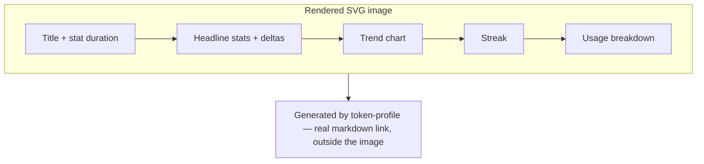
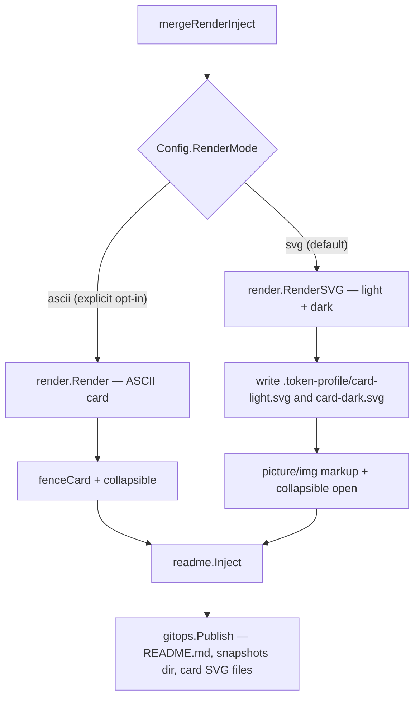

# SVG Dashboard Card - Plan

## Goal Capsule

- **Objective:** Render token-profile's dashboard card as one full-color SVG image by default, in place of the current ASCII card, while keeping the ASCII card available as an explicit opt-in.
- **Product authority:** This document, produced via `ce-brainstorm` dialogue with the repo owner. Extends the existing product defined in `docs/plans/2026-07-03-001-feat-github-token-profile-plan.md` — same actors (Adopter, Profile Visitor), same "no server, no hosted service" design pillar.
- **Product Contract preservation:** Unchanged — Requirements (R1-R8) and Acceptance Examples (AE1-AE4) preserved verbatim. The two Outstanding Questions from the brainstorm are resolved into Planning Contract KTDs below, not carried forward as open items.
- **Open blockers:** None — implementation-ready.

---

## Product Contract

### Summary

token-profile renders its dashboard card as one full-color SVG image by default — title, headline stats, trend chart, streak, and breakdown together, adapting to GitHub's light/dark theme. The attribution link stays outside the image as real markdown text. The existing ASCII card remains available as an explicit opt-in.

### Problem Frame

The current dashboard card renders as plain ASCII text inside a collapsible, fenced code block — functional, but visually flat next to profile widgets that use real graphics. A first idea — styling the existing card with inline HTML/CSS (colored badges, styled headings) — doesn't work: GitHub's markdown renderer strips inline `style` attributes from raw HTML embedded in a README, confirmed directly against GitHub's own rendering API. An SVG image sidesteps this: the sanitizer never inspects an image's internal content, only the HTML that references it, so a generated SVG can carry full color and richer chart rendering that neither ASCII characters nor sanitized HTML text can.

### Key Decisions

- **Whole card as one SVG image, not a chart-only hybrid.** A chart-only version (SVG trend graph, real HTML text for everything else) was considered for keeping card text selectable and accessible. Once full color proved achievable for SVG content specifically, the unified colorful design won out over text-selectability for this feature.
- **HTML/SVG becomes the new default; ASCII stays as an explicit opt-in.** New adopters get the richer card with no config changes; adopters who want plain, selectable, accessible text opt in via config.
- **Attribution link stays outside the image as real markdown.** Links are inert inside an ``-rendered SVG — the same constraint already solved for the ASCII card, whose attribution line lives after its fenced block rather than inside it.
- **Theme adaptivity via light/dark image variants switched through `<picture>`.** `<picture>` + `<source media="(prefers-color-scheme: dark)">` survives GitHub's sanitizer unchanged (verified live), making it the mechanism for the card to look right in both GitHub themes.

### Requirements

**Rendering & Content**

- R1. The default dashboard card renders as one SVG image containing the title, headline stats (tokens, cost, streak, with window-over-window deltas), trend chart, and usage breakdown.
- R2. The attribution line crediting token-profile renders as real markdown text outside the image, not inside it.
- R3. The image's information content matches what the existing ASCII card shows today (title with stat-duration, deltas, breakdown truncation) — the visual redesign drops no data.

**Theme Adaptivity**

- R4. The card image renders correctly in both GitHub's light and dark themes, matching the surrounding page rather than clashing with it.

**Configuration & Compatibility**

- R5. A config field selects which card render mode an adopter gets; unset defaults to the new SVG card.
- R6. Setting the config field to the ASCII mode renders the existing plain-text card exactly as it does today, unchanged.
- R7. Existing adopters who upgrade without setting the config field get the new SVG card automatically on their next run.

**Accessibility**

- R8. The image carries descriptive alt text summarizing the headline stats (tokens, cost, streak), so the core numbers reach screen readers and non-rendering contexts even though the rest of the card's detail doesn't.

### Card composition

### Acceptance Examples

- AE1. **Covers R5, R7.** Given an adopter has not set the render-mode config field, when they upgrade and run token-profile, then their card switches from ASCII to the new SVG image without any config change on their part.
- AE2. **Covers R6.** Given an adopter explicitly sets the render-mode config field to ASCII, when the card renders, then it matches today's plain-text ASCII card exactly.
- AE3. **Covers R4.** Given a profile visitor views the README in GitHub's dark theme, when the card image loads, then its colors and background match the dark theme rather than showing a light-theme image on a dark page.
- AE4. **Covers R8.** Given a screen reader or text-only browser encounters the card image, when it reads the alt text, then it hears the headline tokens/cost/streak numbers, even though the rest of the card's detail isn't available.

### Scope Boundaries

**Deferred for later**

- Chart-only or stat-tiles-only SVG variants — explored and set aside once whole-card color proved viable; worth revisiting if card-text selectability or accessibility becomes a real pain point.
- Skip-regeneration/caching when the chart's underlying data hasn't meaningfully changed — not needed for v1; same unbounded-growth posture already accepted for snapshot files in the existing product.
- Deleting previously-committed image files when an adopter switches render modes — left in place rather than cleaned up, same posture as the growth items above.

**Outside this product's identity**

- Inline data-URI-embedded images — ruled out; GitHub strips `data:` URIs from `` (verified live).
- Hosted/server-side image generation — stays out, unchanged from the existing no-server design pillar.
- Embedded/base64 font data in the SVG — a system font stack is used instead (see KTD3); pixel-perfect cross-viewer text width is not a goal.

### Dependencies / Assumptions

- Depends on GitHub's markdown/HTML sanitizer continuing to strip inline `style` attributes while passing `<picture>` / `<source media>` and repo-relative `` through unchanged — verified against the live `POST /markdown` API on 2026-07-06 (see Sources).
- Assumes committing a regenerated SVG file on every run is an acceptable, unbounded-growth cost — the same posture already accepted for snapshot files in the existing product.
- Assumes adopters' git hosts (primarily GitHub) render `<picture>` / `` from repo-relative paths without needing camo-proxy allowances beyond what GitHub already provides.

### Success Criteria

- The card renders correctly — matches the intended design, stays readable, shows no color or layout glitches — when actually viewed on the real, live GitHub profile in both light and dark theme, not only verified via unit tests or a local preview.
- Adopters who opt into the ASCII render mode see zero behavior change from before this ships.

---

## Planning Contract

### Key Technical Decisions

- **KTD1. SVG generation is hand-rolled via Go's `text/template`, not a new dependency.** Real-world prior art for small, fixed-layout cards (`github-readme-stats`, its Go port `github-readme-stats-go`) converges on hand-rolled template/string assembly rather than a general drawing library — a charting/SVG library (`ajstarks/svgo`, `tdewolff/canvas`) earns its weight for open-ended plotting, not a handful of known rects, text, and one gradient path.
- **KTD2. Theme adaptivity uses two separate static SVG files (light, dark), switched via `<picture>` + `<source media="(prefers-color-scheme: dark)">`.** This is GitHub's own documented, officially-blessed mechanism for adaptive images. A single SVG with an internal `prefers-color-scheme` media query — the brainstorm's other deferred option — is a known-fragile alternative: it fails in Safari, ignores GitHub's own light/dark toggle when it differs from the viewer's OS preference, and breaks on GitHub's mobile apps. This resolves the brainstorm's deferred question in favor of the two-file approach already verified live.
- **KTD3. Card text uses a system/web-safe font stack, not embedded font data.** Matches the ecosystem convention (`github-readme-stats`'s own font stack) and avoids a known WebKit limitation where base64-embedded fonts don't reliably load in ``-referenced SVGs. The card's layout uses generous padding to tolerate the resulting cross-viewer text-width drift instead of chasing pixel-perfect rendering.
- **KTD4. The SVG renderer lives inside the existing `render` package, not a new one.** Reuses the package's existing breakdown-grouping, daily-trend, and token/cost formatting logic directly rather than duplicating or re-exporting it.
- **KTD5. The `RenderMode` config field mirrors the existing `BreakdownMode` pattern exactly** — a string-enum type, a `Default()` value, and a `Validate()` check, matching `internal/config/config.go`'s established shape.
- **KTD6. The image renders inside a `
` collapsible section**, expanded by default but still collapsible — the same wrapper mechanism (`collapsible()`) the ASCII card already uses, just defaulting open instead of closed.
- **KTD7. Switching render modes leaves previously-committed image files in place; no automatic deletion.** Consistent with the project's existing posture of accepting unbounded growth for snapshot files rather than adding cleanup machinery.
- **KTD8. Generated SVG files are committed under `.token-profile/`** (sibling to `.token-profile/snapshots/`) and added explicitly to `gitops.Publish`'s file list via exported path constants that `run()` conditionally appends based on `Config.RenderMode` (mirroring `snapshotRelPath`'s pattern) — not left as an implicit side effect of `mergeRenderInject`'s own logic, the same class of fix this project already made once this cycle, when the snapshot directory restructure was initially left out of that list.

### High-Level Technical Design

### Risks & Dependencies

- **Font-substitution layout drift.** Viewers on different OS/browsers render the system font stack (KTD3) with different actual glyph widths, so fixed-position text could shift or, in an extreme case, clip. Mitigation: generous padding around stat values and breakdown rows in the fixed layout, sized against the widest realistic value (e.g. billions-scale token counts, long model names truncated per U2).
- **Fixed-canvas overflow for outlier data.** Unlike the ASCII card's `box()`, which grows to fit its content, the SVG canvas is a fixed size; an unusually long model name or a larger-than-expected breakdown count could overflow if not truncated. Mitigation: U2 reuses the existing `breakdownLimit` truncation and adds text-length truncation with an ellipsis for individual entries.
- **Dependency on GitHub's current sanitizer/camo-proxy behavior.** KTD2's `<picture>` mechanism and the plain `` path both depend on GitHub continuing to pass them through unchanged, as verified live this cycle (see Sources). If GitHub changes this behavior, the card would silently stop rendering correctly — no code-level mitigation exists beyond noticing it on the next manual verification pass (Verification Contract).

### Sources / Research

- Verified live against GitHub's `POST /markdown` rendering API (2026-07-06): inline `style` attributes are stripped from ``, `<b>`, `<h3>`, `<td>`; `<picture>` + `<source media="(prefers-color-scheme: dark)">` and `` survive and get rewritten through GitHub's camo image proxy; `data:` URI `` values are stripped entirely.
- External research (2026-07-06): hand-rolled SVG generation is the real-world pattern for fixed-layout cards (`github.com/anuraghazra/github-readme-stats`, `github.com/crl-n/github-readme-stats-go`); `github.com/cicirello/user-statistician` is the closest no-server, action-committed architectural analogue; GitHub's official `<picture>`/`<source>` dark-mode guidance (`github.blog/developer-skills/github/how-to-make-your-images-in-markdown-on-github-adjust-for-dark-mode-and-light-mode`) confirms KTD2; a single-SVG `prefers-color-scheme` approach was independently found fragile (Safari failures, OS/GitHub-theme mismatches, mobile-app breakage) by `driesvints.com`'s writeup and the `RodrigoTomeES/prefers-color-scheme-hack` workaround repo.
- Existing product plan: `docs/plans/2026-07-03-001-feat-github-token-profile-plan.md` — actors, current card layout, and the "no server" design pillar carried forward unchanged.
- Existing rendering implementation: `internal/render/render.go` (ASCII card, breakdown/trend helpers reused per KTD4), `internal/config/config.go` (`BreakdownMode` pattern mirrored per KTD5), `internal/cli/run.go` (`fenceCard`/`collapsible` wrapping, and the attribution-link-outside-the-fence precedent R2 follows).

---

## Implementation Units

### U1. `RenderMode` config field

- **Goal:** Add a `RenderMode` config field selecting between the new SVG card (default) and the existing ASCII card, mirroring `BreakdownMode`'s shape.
- **Requirements:** R5, R6, R7
- **Dependencies:** none
- **Files:** `internal/config/config.go`, `internal/config/config_test.go`
- **Approach:** `type RenderMode string` with `RenderModeSVG = "svg"` and `RenderModeASCII = "ascii"` constants; `Default()` sets `RenderMode: RenderModeSVG`; `Validate()` rejects unrecognized values with an actionable error, same shape as the existing `Breakdown` check; `WriteTemplate` explicitly writes `renderMode: "svg"` into scaffolded configs, mirroring how `breakdown` is already written explicitly rather than left implicit.
- **Test scenarios:**
  - Happy path: a config file with no `renderMode` key loads with `RenderMode == RenderModeSVG`.
  - Happy path: `"renderMode": "ascii"` loads as `RenderModeASCII`.
  - Error path: an unrecognized `renderMode` value fails `Validate()` with an error naming the recognized values.
  - Edge case: `WriteTemplate`'s scaffolded config explicitly includes `renderMode: "svg"`.
- **Verification:** `go test ./internal/config/...` passes.

### U2. SVG dashboard-card renderer (light + dark)

- **Goal:** Generate the whole-card SVG image (title, headline stats with deltas, trend chart, streak, breakdown) as light and dark variants from a merged dataset and summary, plus a short alt-text summary string.
- **Requirements:** R1, R3, R4, R8
- **Dependencies:** none
- **Files:** `internal/render/svg.go`, `internal/render/svg_test.go`, `internal/render/testdata/dashboard_card_light.golden.svg`, `internal/render/testdata/dashboard_card_dark.golden.svg`
- **Approach:** One `text/template`-based layout shared by both variants; only a small palette (background, text, accent colors — light vs. dark) differs between them, following the color-module pattern `cicirello/user-statistician` uses. Reuses the render package's existing daily-trend grouping and breakdown-grouping helpers directly (KTD4) rather than re-deriving them; the trend line/area is drawn from the same data those helpers already produce, scaled to fixed SVG coordinates. Breakdown truncation reuses the existing `breakdownLimit` logic so the fixed canvas never has to accommodate an unbounded number of rows; individual long entries (e.g. a long model name) are additionally truncated with an ellipsis to the layout's available column width, since the fixed canvas — unlike the ASCII card's auto-sizing box — cannot grow to fit an outlier value (see Risks & Dependencies). A small exported alt-text helper renders the headline stats (tokens, cost, streak with deltas) as one plain-text sentence for R8, consumed by U3 when building the `` attribute.
- **Test scenarios:**
  - Happy path: a multi-day, multi-model fixture dataset renders light and dark SVGs each containing the title, stat values, deltas, trend line, and breakdown entries.
  - Edge case: an empty dataset renders a "no data yet" card variant rather than an empty or malformed chart, mirroring the ASCII renderer's existing empty-state handling; the alt-text helper's output for this same case names the "no data yet" state explicitly rather than a misleadingly precise all-zero stat sentence.
  - Edge case: a single-day dataset renders a degenerate (single-point) chart without error, mirroring the ASCII renderer's existing single-day handling.
  - Edge case: a breakdown with more entries than the configured limit truncates to the top N plus a summary count, fitting the fixed card layout without overflow.
  - Golden-file comparison: both light and dark output match their respective golden files for the shared fixture dataset, mirroring the existing ASCII golden-file test.
- **Verification:** `go test ./internal/render/...` passes.

### U3. Wire render mode into the run pipeline

- **Goal:** Branch `mergeRenderInject` on `Config.RenderMode`: the ASCII path is unchanged; the SVG path writes both image files under the target repo, builds the `<picture>` + collapsible + attribution markup, and ensures the new files are actually committed.
- **Requirements:** R1, R2, R5, R6, R7
- **Dependencies:** U1, U2
- **Files:** `internal/cli/run.go`, `internal/cli/run_test.go`
- **Approach:** Branch on `deps.Config.RenderMode` (unset resolves to the SVG default per U1). The SVG path writes `.token-profile/card-light.svg` and `.token-profile/card-dark.svg` (KTD8), builds `<picture><source media="(prefers-color-scheme: dark)" srcset="<dark path>">" alt="<R8 summary>" width="100%"></picture>` — the `` carries `width="100%"` with no fixed pixel height, so the fixed-canvas SVG (see Risks & Dependencies) scales down cleanly on narrow viewports instead of overflowing or clipping — and wraps it with the existing `collapsible()` helper opened by default (KTD6) plus the existing attribution line, with the same blank-line placement the ASCII path already relies on for GitHub to parse the nested content as markdown rather than literal text. Because the file list `gitops.Publish` commits is actually built in `run()` as a static slice (`files := []string{snapshotRelPath(deps.MachineID), readmeFile}`), separate from `mergeRenderInject` itself, the two new SVG paths are exposed as exported path constants (mirroring `snapshotRelPath`'s pattern) that `run()` conditionally appends to that slice based on `deps.Config.RenderMode` (KTD8) — not left as an implicit side effect of `mergeRenderInject`'s own logic, which has no visibility into `run()`'s file list.
- **Test scenarios:**
  - Happy path (Covers AE1): an unset `RenderMode` produces both SVG files, injects the `<picture>` markup into the README, and commits/pushes all of it together.
  - Happy path (Covers AE2): an explicit ASCII `RenderMode` renders and commits exactly what the ASCII path produced before this change.
  - Integration: the two SVG files land in the target repo's git history alongside the README update, not left uncommitted.
  - Edge case: re-running in SVG mode overwrites the same two file paths rather than accumulating new ones.
- **Verification:** `go test ./internal/cli/...` and `go test -race ./internal/cli/...` pass.

### U4. README injection shape and documentation

- **Goal:** Get the SVG card's injected markup and the project's own README documentation right — correct nesting so GitHub renders the dark-mode source and the alt text, and the config table reflects the new field and default.
- **Requirements:** R2, R4, R8
- **Dependencies:** U3
- **Files:** `internal/cli/run_test.go`, `README.md`
- **Approach:** Verify the exact injected structure end-to-end (this is a test-and-documentation unit, not new production code beyond what U3 already wrote) — in particular that the `<picture>` block and its surrounding blank lines follow the same nesting convention `fenceCard`/`collapsible` already establish for the ASCII path (blank line before and after the raw-HTML/markdown-mixed content, required for GitHub to parse the nested markdown rather than render it as literal text). Update two specific `README.md` spots: the Configuration section's field table (add a `renderMode` row alongside `breakdown`) and the Quick start / example-card section — the new SVG presentation replaces the current fenced ASCII example as the primary illustration, and the existing ASCII example is demoted to a clearly-headed "ASCII mode" subsection immediately below it, rather than leaving the two ambiguously side by side.
- **Test scenarios:**
  - Covers AE3: the injected `<picture>` block's dark `<source>` has the correct `prefers-color-scheme: dark` media query, distinct from the light `` fallback.
  - Covers AE4: the `` element's `alt` attribute contains the headline tokens/cost/streak text.
  - Happy path: the attribution line still sits outside the `<picture>` block, matching R2.
- **Verification:** `go test ./internal/cli/...` passes; `README.md` documents `renderMode` consistently with the other config fields.

---

## Verification Contract

| Command | Applies to | Gate |
|---|---|---|
| `go build ./...` | All units | Build succeeds |
| `go vet ./...` | All units | No vet warnings |
| `gofmt -l .` | All units | Empty output |
| `go test ./...` | All units | All unit and golden-file tests pass |
| `go test -race ./internal/cli/...` | U3 | Clean under the race detector, per this package's existing convention |
| Manual: build the binary, run against a real target repo, view the README on GitHub in both light and dark theme, and at a narrow/mobile viewport width | U2, U3, U4 | Card renders correctly in both themes and scales legibly at mobile width (Success Criteria) — not verified by unit tests alone |

---

## Definition of Done

- All 4 implementation units (U1-U4) merged.
- `go build ./...`, `go vet ./...`, and `gofmt -l .` are clean; `go test ./...` passes, including the new light/dark golden-file tests.
- The existing ASCII golden file (`internal/render/testdata/dashboard_card.golden`) is unchanged — the opt-in ASCII mode has zero regression.
- The card is visually confirmed correct on the real, live GitHub profile in both light and dark theme, not only unit-tested.
- `README.md` documents the `renderMode` config field and the new default behavior.
- No leftover scratch or experimental files from manual verification.
