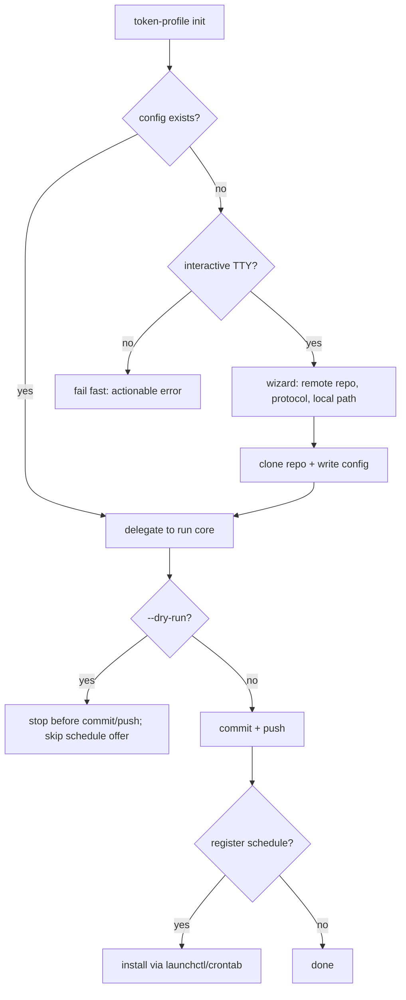

# Guided Setup & Teardown - Plan

## Goal Capsule

- **Objective:** Replace token-profile's manual, error-prone first-run setup (hand-authored `config.json` against an already-cloned repo, copy-pasted schedule-install commands) and its absent teardown path with a guided `init` wizard, `--dry-run` on `init`/`run`, and a new `cleanup` command.
- **Product authority:** This brainstorm dialogue (2026-07-07).
- **Open blockers:** None — every scope fork raised during dialogue was resolved.

---

## Product Contract

### Summary

`init` auto-detects a missing config and runs a small `charmbracelet/bubbletea` wizard for the three fields that need a real decision — remote repo, protocol, local clone path — then clones the repo and writes the rest of the config with hand-editable defaults, and offers to register the refresh schedule. `--dry-run` on `init` and `run` performs every real file write except any non-reversible step. A new `cleanup` command reverses the local footprint behind a confirmation prompt.

### Problem Frame

Today's first run requires hand-authoring `config.json` against a working copy the adopter must have already cloned themselves, then copy-pasting a schedule snippet from the README into `launchctl`/`crontab` — a flow that has already produced real confusion in practice (a wrong `sudo launchctl load` invocation, a non-idempotent `bootstrap` retry). There is also no way back: nothing in the CLI undoes a schedule registration or the README/`.token-profile/` footprint once an adopter decides to stop using token-profile on a repo.

### Key Decisions

- **Init performs the clone itself.** Replaces today's assumption that `targetRepo` is already an existing local working copy (`requireGitWorkTree`, `internal/cli/run.go:208-221`) — the one-step setup the wizard promises. Reuses the existing narrow auto-clone shortcut's default-guessing logic rather than inventing new defaults.
- **The old narrow auto-clone shortcut is replaced, not kept as a parallel path.** `bootstrapConfig`/`confirmAutoClone` (`internal/cli/init.go:321-405`) is subsumed by the wizard instead of surviving alongside it — two divergent init-bootstrap code paths for the same job isn't worth the complexity.
- **`targetRepo` stays the single field every package reads.** `remoteRepo`/`cloneProtocol` are new, wizard-only inputs kept for re-clone reference; `targetRepo` is set to the local clone path once cloning succeeds, so existing call sites (`run.go`, `internal/gitops`) are unchanged.
- **The wizard prompts only 3 of 8 fields.** Breakdown mode, render mode, trailing window, breakdown limit, and schedule interval already have (or gain) safe defaults; they're written silently and stay hand-editable in `config.json`, exactly as config fields are today.
- **Schedule interval becomes a real config field.** It's currently a hardcoded constant (`21600` / `0 */6 * * *`, `internal/cli/init.go:191-199`); since the wizard-scope decision above requires it to be hand-editable afterward, the schedule-snippet generator needs an actual field to read instead of a hardcoded value.
- **Every new surface fails safe over auto-completing.** No TTY means fail fast with an actionable error rather than silently scaffolding a config; `cleanup` and both `--dry-run` modes never auto-commit or auto-push; `cleanup` checks live schedule state before claiming anything was removed.

### Actors

- A1. Adopter — the human running token-profile interactively on their own machine.
- A2. Unattended scheduler — cron/launchd invoking `token-profile run` (or occasionally `init`) with no TTY attached.
- A3. Target repo — the local git working copy (and its remote), holding `README.md` and `.token-profile/`.

### Key Flows

F1. Guided init (interactive)

- **Trigger:** Adopter (A1) runs `token-profile init` with no config file present.
- **Actors:** A1, A3
- **Outcome:** repo cloned, config written, README markers ensured, schedule optionally installed.
- **Covers:** R1, R2, R3, R4, R5, R6, R8

F2. Unattended invocation with missing config

- **Trigger:** Unattended scheduler (A2) invokes `run` (or `init`) with no config and no TTY.
- **Actors:** A2
- **Steps:** CLI detects the missing config and absent TTY, exits non-zero with an error naming the config path and pointing at interactive `init`; nothing is written.
- **Outcome:** a predictable, scriptable failure instead of a hang or a silently-defaulted config.
- **Covers:** R5

F3. Dry run (`run --dry-run`)

- **Trigger:** Adopter (A1) runs `token-profile run --dry-run` with config already present.
- **Actors:** A1, A3
- **Steps:** resolve usage, write snapshot, render card, inject README, then stop before commit/push and print a summary.
- **Outcome:** a real, inspectable working-tree diff; no commit, no push.
- **Covers:** R7, R9

F4. Cleanup

- **Trigger:** Adopter (A1) runs `token-profile cleanup`.
- **Actors:** A1, A3
- **Steps:** confirm, check live schedule state, deregister only if found, strip the marker content from `README.md`, delete `.token-profile/` from the target repo's working tree, leave `~/.token-profile/` untouched, leave commit/push to the Adopter.
- **Outcome:** the local footprint is reversed and the target repo's working tree holds an inspectable, uncommitted restoration.
- **Covers:** R10, R11, R12, R13, R14

### Requirements

**Guided init wizard**

- R1. When `init` runs and no config file exists at the resolved config path, it launches an interactive wizard instead of failing.
- R2. The wizard prompts for exactly three fields — remote repo URL, clone protocol (https/ssh), and local clone path — pre-filled with the same defaults as today's guessed-URL shortcut, each editable before confirming.
- R3. On confirmation, the wizard validates the three fields, clones the remote repo to the local clone path if it doesn't already exist, writes a full config with those three fields plus safe defaults for the remaining five, then proceeds through `init`'s existing flow (README markers, run core).
- R4. After a successful (non-dry-run) init, the CLI asks whether to register the refresh schedule; on yes, it performs the registration itself rather than only writing a reviewable snippet as today.
- R5. When `init` or `run` needs a config that doesn't exist and there is no interactive TTY, the CLI fails immediately with an actionable error naming the missing config — no config is ever silently scaffolded with defaults.
- R6. Every field the wizard doesn't prompt for stays a normal, hand-editable field in `config.json`, exactly as today.

**Dry run**

- R7. `--dry-run` on `run` performs usage resolution, snapshot write, card render, and README injection as normal, then stops before `git commit`/`push`, printing a summary of what would have been committed.
- R8. `--dry-run` on `init` performs the same real writes as R7 (clone, config write, README markers) and stops at the same point, and additionally skips the schedule-registration offer from R4 entirely.
- R9. Both dry-run modes leave the target repo's working tree with real, inspectable changes — never touching git history or the remote.

**Cleanup**

- R10. A new `cleanup` command, gated on an explicit confirmation prompt, reverses token-profile's footprint on the current machine and the target repo's working tree.
- R11. `cleanup` checks the live schedule state before acting and deregisters it only if something is actually found, reporting accurately either way (removed vs. nothing to remove).
- R12. `cleanup` restores `README.md` to its pre-injection state (strips the content between the markers) and deletes `.token-profile/` from the target repo's working tree.
- R13. `cleanup` only edits the target repo's local working tree — it never commits or pushes; review and commit/push are left to the Adopter.
- R14. `cleanup` never touches `~/.token-profile/` itself (config, machine-id, cloned repos) — only the target repo's own footprint and this machine's schedule registration.

### Acceptance Examples

- AE1. **Covers R5.** Given no config file and no TTY (e.g. `run` invoked from cron), when `token-profile run` executes, then it exits non-zero with an error naming the missing config path and pointing at interactive `init`, without writing any file.
- AE2. **Covers R8.** Given `token-profile init --dry-run` on a fresh machine, when the wizard is confirmed, then the repo is cloned and config/README are written to disk, but the schedule-registration prompt never appears and no commit/push happens.
- AE3. **Covers R11.** Given a machine where no schedule was ever installed, when `token-profile cleanup` runs, then it reports "no schedule registered" rather than "removed" — and reports "removed" only when one is actually found.

### Scope Boundaries

- **Deferred for later:** a full 8-field review/edit screen — only the 3 clone-related fields are interactively prompted.
- **Deferred for later:** persistently tracking installed-schedule state — `cleanup` checks live OS state at run time instead.
- **Outside this scope:** keeping the old narrow auto-clone shortcut (`bootstrapConfig`/`confirmAutoClone`) as a parallel fast path — it's replaced outright by the wizard.

### Dependencies / Assumptions

- New dependency: `charmbracelet/bubbletea` (plus likely `bubbles`/`lipgloss` for form widgets) — currently absent from `go.mod`.
- Assumes `launchctl bootstrap`/`bootout` and `crontab` remain the install/removal mechanisms; the legacy `launchctl load`/`unload` are unreliable on current macOS and should not be used for the new install/cleanup paths.
- Assumes git clone authentication (SSH keys or an HTTPS credential helper) is already configured on the machine — token-profile doesn't manage credentials itself.

### Sources / Research

- `internal/cli/init.go:321-405` (`bootstrapConfig`) — the existing narrow auto-clone shortcut being replaced; its default-guessing logic (`profileRepoURL` init.go:306-315, `gitGlobalUserName` init.go:281-289) is reused as the wizard's pre-filled values.
- `internal/cli/init.go:260-275` (`isInteractive`) — existing TTY-detection pattern, relevant to the no-TTY fail-fast requirement.
- `internal/cli/run.go:117-158` — `run()`'s step order; the natural dry-run cutoff is right before `gitops.Publish` at `run.go:152`.
- `internal/config/config.go:50-101` — `Config` struct, `Default()`, `Validate()` — where new fields (`remoteRepo`, `cloneProtocol`, `scheduleInterval`) join.
- `internal/cli/init.go:160-202` (`ensureSchedulingEntry`/`schedulingEntryContent`) — snippet generation to parameterize with the new schedule-interval field, and to extend into an actual `launchctl`/`crontab` install.
- `internal/readme/inject.go:48-91` (`Inject`) — marker replacement with no existing reverse operation; `cleanup` needs a new strip function.
- `internal/cli/run_test.go` / `internal/cli/init_test.go` fixture helpers (`initBareRemote`, `seedRemote`, `cloneWorkdir`, `bootstrapDeps`) — existing TDD fixture patterns to extend for the wizard/dry-run/cleanup tests.
