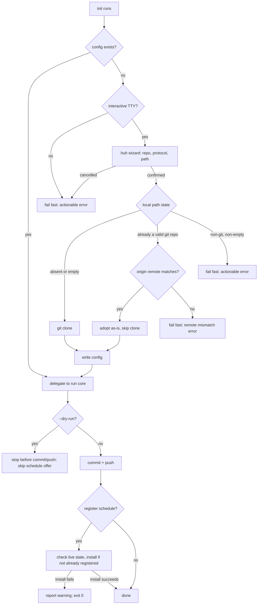
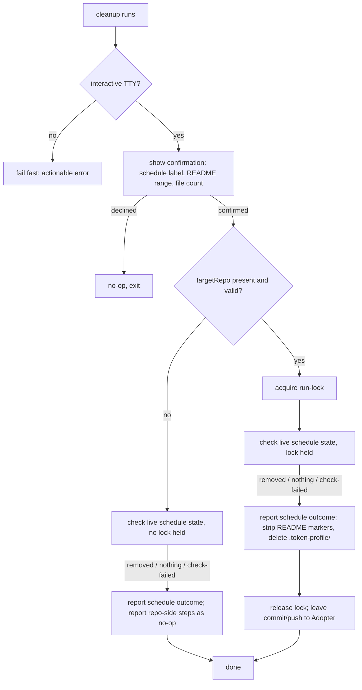

# Guided Setup & Teardown - Plan

## Goal Capsule

- **Objective:** Replace token-profile's manual, error-prone first-run setup (hand-authored `config.json` against an already-cloned repo, copy-pasted schedule-install commands) and its absent teardown path with a guided `init` wizard, `--dry-run` on `init`/`run`, and a new `cleanup` command.
- **Product authority:** Product Contract below (brainstorm dialogue, 2026-07-07).
- **Execution profile:** Strict TDD against real local git fixtures (bare repo + clone), matching this repo's existing convention — no mocked git, no mocked filesystem.
- **Open blockers:** None.

**Product Contract preservation:** unchanged from the brainstorm except the Summary's wizard-library mention (see Planning Contract KTD1) and three added Acceptance Examples (AE4-AE6); no R-ID content or numbering changed.

---

## Product Contract

### Summary

`init` auto-detects a missing config and runs a small `huh` (built on `bubbletea`) wizard for the three fields that need a real decision — GitHub username, clone protocol, local clone path — then clones the repo and writes the rest of the config with safe, hand-editable defaults. After init, it offers to register the refresh schedule via cron/launchd. `--dry-run` on `init` and `run` stops before any non-reversible step: on `run` that's the git commit/push; on `init` that additionally means skipping the schedule-registration offer entirely. A new `cleanup` command checks the live launchctl/crontab state before acting — deregistering and reporting "removed" only when something is actually found — then strips the README card and `.token-profile/` from the target repo's working tree, behind a confirmation prompt, leaving the actual commit/push to the user and `~/.token-profile/` itself untouched.

### Problem Frame

Today's first run requires hand-authoring `config.json` against a working copy the adopter must have already cloned themselves, then copy-pasting a schedule snippet from the README into `launchctl`/`crontab` — a flow that has already produced real confusion in practice (a wrong `sudo launchctl load` invocation, a non-idempotent `bootstrap` retry). There is also no way back: nothing in the CLI undoes a schedule registration or the README/`.token-profile/` footprint once an adopter decides to stop using token-profile on a repo.

### Key Decisions

- **Init performs the clone itself.** Replaces today's assumption that `targetRepo` is already an existing local working copy (`requireGitWorkTree`, `internal/cli/run.go:208-221`) — the one-step setup the wizard promises. Reuses the existing narrow auto-clone shortcut's default-guessing logic rather than inventing new defaults.
- **The old narrow auto-clone shortcut is replaced, not kept as a parallel path.** `bootstrapConfig`/`confirmAutoClone` (`internal/cli/init.go:321-405`) is subsumed by the wizard instead of surviving alongside it — two divergent init-bootstrap code paths for the same job isn't worth the complexity.
- **`targetRepo` stays the single field every package reads.** `remoteRepo`/`cloneProtocol` are new, wizard-only inputs kept for re-clone reference; `targetRepo` is set to the local clone path once cloning succeeds, so existing call sites (`run.go`, `internal/gitops`) are unchanged.
- **The wizard prompts only 3 of 8 fields.** Breakdown mode, render mode, trailing window, breakdown limit, and schedule interval already have (or gain) safe defaults; they're written silently and stay hand-editable in `config.json`, exactly as config fields are today.
- **Schedule interval becomes a real config field.** It's currently a hardcoded constant (`21600` / `0 */6 * * *`, `internal/cli/init.go:191-199`); since the wizard-scope decision above requires it to be hand-editable afterward, the schedule-snippet generator needs an actual field to read instead of a hardcoded value.
- **Every new surface fails safe over auto-completing.** No TTY means fail fast with an actionable error rather than silently scaffolding a config; `cleanup` and both `--dry-run` modes never auto-commit or auto-push; `cleanup` checks live schedule state before claiming anything was removed.

### Actors

- A1. Adopter — the human running token-profile interactively on their own machine.
- A2. Unattended scheduler — cron/launchd invoking `token-profile run` (or occasionally `init`) with no TTY attached.
- A3. Target repo — the local git working copy (and its remote), holding `README.md` and `.token-profile/`.

### Key Flows

F1. Guided init (interactive)

- **Trigger:** Adopter (A1) runs `token-profile init` with no config file present.
- **Actors:** A1, A3
- **Outcome:** repo cloned (or an existing valid clone with a matching remote adopted), config written, README markers ensured, schedule optionally installed — a failed live-install attempt is reported as a warning, not a command failure (KTD17).
- **Covers:** R1, R2, R3, R4, R5, R6, R8

F2. Unattended invocation with missing config

- **Trigger:** Unattended scheduler (A2) invokes `run` (or `init`) with no config and no TTY.
- **Actors:** A2
- **Steps:** CLI detects the missing config and absent TTY, exits non-zero with an error naming the config path and pointing at interactive `init`; nothing is written.
- **Outcome:** a predictable, scriptable failure instead of a hang or a silently-defaulted config.
- **Covers:** R5

F3. Dry run (`run --dry-run`)

- **Trigger:** Adopter (A1) runs `token-profile run --dry-run` with config already present.
- **Actors:** A1, A3
- **Steps:** resolve usage, write snapshot, render card, inject README, then stop before commit/push and print a summary.
- **Outcome:** a real, inspectable working-tree diff; no commit, no push.
- **Covers:** R7, R9

F4. Cleanup

- **Trigger:** Adopter (A1) runs `token-profile cleanup`.
- **Actors:** A1, A3
- **Steps:** confirm, check live schedule state, deregister only if found, strip the marker content from `README.md`, delete `.token-profile/` from the target repo's working tree, leave `~/.token-profile/` untouched, leave commit/push to the Adopter.
- **Outcome:** the local footprint is reversed and the target repo's working tree holds an inspectable, uncommitted restoration.
- **Covers:** R10, R11, R12, R13, R14

### Requirements

**Guided init wizard**

- R1. When `init` runs and no config file exists at the resolved config path, it launches an interactive wizard instead of failing.
- R2. The wizard prompts for exactly three fields — a GitHub username/handle (used to construct the profile-repo clone URL via the existing `username/username` convention), clone protocol (https/ssh), and local clone path — pre-filled with the same defaults as today's guessed-URL shortcut, each editable before confirming.
- R3. On confirmation, the wizard validates the three fields, clones the remote repo to the local clone path if it doesn't already exist, writes a full config with those three fields plus safe defaults for the remaining five, then proceeds through `init`'s existing flow (README markers, run core).
- R4. After a successful (non-dry-run) init, the CLI asks whether to register the refresh schedule; on yes, it performs the registration itself rather than only writing a reviewable snippet as today.
- R5. When `init` or `run` needs a config that doesn't exist and there is no interactive TTY, the CLI fails immediately with an actionable error naming the missing config — no config is ever silently scaffolded with defaults.
- R6. Every field the wizard doesn't prompt for stays a normal, hand-editable field in `config.json`, exactly as today.

**Dry run**

- R7. `--dry-run` on `run` performs usage resolution, snapshot write, card render, and README injection as normal, then stops before `git commit`/`push`, printing a summary of what would have been committed.
- R8. `--dry-run` on `init` performs the same real writes as R7 (clone, config write, README markers) and stops at the same point, and additionally skips the schedule-registration offer from R4 entirely.
- R9. Both dry-run modes leave the target repo's working tree with real, inspectable changes — never touching git history or the remote.

**Cleanup**

- R10. A new `cleanup` command, gated on an explicit confirmation prompt, reverses token-profile's footprint on the current machine and the target repo's working tree.
- R11. `cleanup` checks the live schedule state before acting and deregisters it only if something is actually found, reporting accurately either way (removed vs. nothing to remove).
- R12. `cleanup` restores `README.md` to its pre-injection state (strips the content between the markers) and deletes `.token-profile/` from the target repo's working tree.
- R13. `cleanup` only edits the target repo's local working tree — it never commits or pushes; review and commit/push are left to the Adopter.
- R14. `cleanup` never touches `~/.token-profile/` itself (config, machine-id, cloned repos) — only the target repo's own footprint and this machine's schedule registration.

### Acceptance Examples

- AE1. **Covers R5.** Given no config file and no TTY (e.g. `run` invoked from cron), when `token-profile run` executes, then it exits non-zero with an error naming the missing config path and pointing at interactive `init`, without writing any file.
- AE2. **Covers R8.** Given `token-profile init --dry-run` on a fresh machine, when the wizard is confirmed, then the repo is cloned and config/README are written to disk, but the schedule-registration prompt never appears and no commit/push happens.
- AE3. **Covers R11.** Given a machine where no schedule was ever installed, when `token-profile cleanup` runs, then it reports "no schedule registered" rather than "removed" — and reports "removed" only when one is actually found.
- AE4. **Covers R11.** Given the live schedule-state check itself fails (e.g. the underlying command errors for a reason other than "not found"), when `cleanup` runs, then it reports a distinct "couldn't determine schedule state" outcome rather than collapsing it into "nothing to remove."
- AE5. **Covers R10, R12.** Given `cleanup` already ran successfully once, when it's run again against the same, now-clean repo, then it reports "nothing to remove" for each already-absent piece (schedule, README markers, `.token-profile/`) rather than erroring.
- AE6. **Covers R1, R3.** Given a config file exists but `targetRepo` points at a path that's missing or not a git repository, when `init` runs again, then it fails with the existing "not a git repository" error unchanged — the wizard is not re-triggered, since a config already exists.

### Scope Boundaries

- **Deferred for later:** a full 8-field review/edit screen — only the 3 clone-related fields are interactively prompted.
- **Deferred for later:** persistently tracking installed-schedule state — `cleanup` checks live OS state at run time instead.
- **Deferred for later:** automatic re-clone recovery when a re-run `init` finds `targetRepo` missing or corrupted — the persisted `remoteRepo`/`cloneProtocol` are informational only in this iteration (AE6).
- **Outside this scope:** keeping the old narrow auto-clone shortcut (`bootstrapConfig`/`confirmAutoClone`) as a parallel fast path — it's replaced outright by the wizard.

### Dependencies / Assumptions

- New dependency: `charm.land/huh/v2` (pulls in `charm.land/bubbletea/v2`, `charm.land/bubbles/v2`) — currently absent from `go.mod`.
- Assumes `launchctl bootstrap`/`bootout` and `crontab` remain the install/removal mechanisms; the legacy `launchctl load`/`unload` are unreliable on current macOS and are not used for the new install/cleanup paths.
- Assumes git clone authentication (SSH keys or an HTTPS credential helper) is already configured on the machine — token-profile doesn't manage credentials itself.

---

## Planning Contract

### Key Technical Decisions

- **KTD1. Use `charm.land/huh/v2` (built on `charm.land/bubbletea/v2`), not hand-rolled `bubbletea`.** The whole Charm stack ships a coordinated v2 (new `charm.land/...` import path); `huh` is purpose-built for a 3-field-plus-confirm form, needs far less code than juggling `bubbles/textinput` focus/tab state by hand, and its accessible-mode test seam fits this repo's strict-TDD, TTY-free testing convention better than scripting a real `tea.Program`. (The existing zero-dependency `bufio.Scanner` y/N idiom used elsewhere in this plan — the schedule-registration prompt, `cleanup`'s confirmation — was considered for the 3-field form too, but doesn't extend cleanly to inline per-field validation-and-reprompt across three related fields without hand-rolling the same state machine `huh` already provides; it stays the right tool for the single yes/no prompts it's kept for.)
- **KTD2. Wizard tests drive `huh`'s accessible mode exclusively** (`form.WithAccessible(true).WithInput(strings.NewReader(...)).WithOutput(&buf)`), never a real `tea.Program` — fast, deterministic, no pty, matching every other test in this repo. Cancellation is read from the form's own trailing confirm-group answer (a plain `bool`), not from `huh.ErrUserAborted`: `huh`'s `runAccessible` path unconditionally discards each field's `RunAccessible` error and always returns `nil`, so no scripted-input sequence under accessible mode can ever produce `ErrUserAborted` — only a real `tea.Program` run (an interactive ctrl+c) can. The wizard's caller checks the confirm field's value after `Form.Run()` returns and treats a declined confirm as the cancellation signal; a separate, non-accessible-mode-tested `ErrUserAborted` check remains as a production-only safeguard for a genuine interactive ctrl+c.
- **KTD3. The clone step sets `GIT_TERMINAL_PROMPT=0` and redirects `git clone`'s stdin from `/dev/null`.** Without this, a missing-credential auth failure can hang invisibly behind the wizard's terminal control instead of returning a clean, immediate error.
- **KTD4. Clone pre-check has three outcomes.** An existing, valid git working tree at the local clone path has its `origin` remote compared against the resolved remote URL: a match adopts it as-is (clone skipped), a mismatch fails fast with an actionable error naming both URLs rather than silently wiring up an unrelated repo as the publish target; an existing non-git, non-empty path fails fast with an actionable error before `git clone` is ever invoked; an absent or empty path is cloned normally. Each of the three outcomes prints a distinct one-line status so the adopter can tell what happened.
- **KTD5. `cleanup` acquires the same per-repo run-lock as `run`/`init`** (`acquireRunLock`, `internal/cli/lock.go`) only when `targetRepo` is confirmed present and a valid git repo — checked *before* acquiring the lock, not after — so a scheduled `run` firing mid-`cleanup` (or the reverse) can't race on `README.md` or delete the lock file out from under a concurrent holder. When `targetRepo` is missing or corrupted, lock acquisition is skipped entirely: `acquireRunLock`'s `MkdirAll` would otherwise silently recreate the deleted directory as a side effect of taking the lock, undermining KTD6's whole premise. Schedule deregistration itself never depends on the lock or on `targetRepo`'s validity.
- **KTD6. `cleanup` decouples schedule deregistration from target-repo cleanup.** A missing or corrupted `targetRepo` degrades the repo-side steps to a reported no-op rather than aborting the whole command, so an adopter who already deleted their clone can still stop the schedule — and never has that deleted directory silently resurrected merely by `cleanup` checking on it (see KTD5).
- **KTD7. The live schedule-state check reports three distinct outcomes** — removed, nothing to remove, check failed — never collapsing a check error into a false "nothing to remove" (AE4).
- **KTD8. `cleanup` is idempotent.** Re-running it against an already-cleaned repo reports "nothing to remove" per already-absent piece instead of erroring, matching every other init-adjacent operation's documented idempotence (AE5).
- **KTD9. README marker-strip mirrors `readme.Inject`'s between-markers-only model** — the marker lines themselves stay in place, only the interior content clears — keeping `cleanup` reversible via a later plain re-`init`. This is what R12's "pre-injection state" operationally means.
- **KTD10. `scheduleInterval` is a new `time.Duration` config field, validated against a fixed set of cron-compatible hourly divisors** (1/2/3/4/6/8/12/24h); other values are rejected with an actionable error naming the accepted set. launchd's `StartInterval` accepts the raw duration in seconds with no such constraint.
- **KTD11. The wizard validates the remote-repo field against GitHub-username shape** (alphanumeric/hyphen, no leading/trailing hyphen, ≤39 chars) beyond `validAutoCloneName`'s existing path-safety check, so a `git config user.name` like "John Smith" doesn't silently pre-fill a broken URL.
- **KTD12. `cleanup` requires a TTY and fails fast identically to `run`/`init` (R5) when none is present** — no `--yes`/`--force` non-interactive override in this iteration.
- **KTD13. `init`'s schedule registration also checks live state first** (mirroring `cleanup`'s check), so re-running `init` is idempotent against `launchctl bootstrap`'s "already loaded" failure.
- **KTD14. The `--clone-protocol` cobra flag is removed** (obsoleted by the wizard's protocol field); `--schedule-dest` stays — `init` still writes the reviewable snippet there in addition to performing the live registration.
- **KTD15. The run-lock file relocates from `<repoDir>/.token-profile/run.lock` to `<repoDir>/.token-profile.lock`, a sibling of `.token-profile/` rather than nested inside it.** `cleanup`'s own deletion of `.token-profile/` would otherwise destroy the lock file it's still holding for the remainder of its execution (deletion happens before the lock is released), reopening exactly the concurrent-race window KTD5 exists to close.
- **KTD16. Schedule install/remove always target the invoking user's own launchd GUI domain** (`launchctl bootstrap gui/$(id -u) <plist>` / `bootout gui/$(id -u)/<label>`), never `sudo` or the system domain. Running as root breaks `gui/<uid>`'s binding to the invoking user's own login session — confirmed firsthand, a `sudo launchctl bootstrap` invocation fails identically to the unprivileged case — and `init` now performing live registration itself (R4) makes this the exact footgun the Problem Frame's motivating incident already hit, reintroduced automatically instead of copy-pasted.
- **KTD17. A failed live schedule-install attempt after a successful init commit/push degrades to a reported warning, not a non-zero exit.** Init's critical work (clone, config, first publish) has already landed by that point; scheduling is best-effort auxiliary setup the adopter can retry or install manually from the still-written `--schedule-dest` snippet.

### High-Level Technical Design

Guided init, end to end:

Cleanup:

### Risks & Dependencies

- **Risk:** `charm.land/huh/v2` is a young v2 release (Feb-Mar 2026). **Mitigation:** pin an exact version in `go.mod` (not a loose constraint); U3's tests exercise the real dependency, so a breaking patch release fails CI rather than surfacing only at runtime.
- **Risk:** `launchctl`/`crontab` behavior varies across macOS versions (already observed firsthand: `launchctl load` unreliable on Sonoma 14.4). **Mitigation:** U4 uses `launchctl bootstrap`/`bootout` (the modern, non-deprecated subsystem) exclusively, never `load`/`unload`; fixture-backed tests (U4) prove the command shape but a real-machine smoke check on at least one supported macOS version before tagging a release is recommended, since no CI runner exercises the real launchd.
- **Risk:** An implementation could target the wrong launchd domain (system vs. the invoking user's GUI domain), reintroducing the exact `sudo`/privilege confusion this plan's Problem Frame cites as motivation — this time invoked automatically by `init` (R4) rather than copy-pasted by the adopter. **Mitigation:** KTD16 hardcodes `gui/$(id -u)` for both install and remove; U4's own test asserts the domain argument used.
- **Risk:** Git clone authentication is assumed pre-configured (SSH keys or an HTTPS credential helper); token-profile manages no credentials itself. **Mitigation:** KTD3's `GIT_TERMINAL_PROMPT=0` turns a missing-credential clone into an immediate, clear failure rather than a silent hang — the risk is adopter friction on first run, not a hang or a security gap.
- **Risk:** `teatest`/`teatest/v2` remains experimental (`x/exp`) and unsuited to this repo's stability bar. **Mitigation:** KTD2 avoids it entirely, testing exclusively through `huh`'s stable, released accessible-mode API.

### Sources / Research

- `internal/cli/lock.go` (all) — `acquireRunLock`/`processAlive` run-lock mechanism U8 (`cleanup`) reuses; PID-liveness-checked, stale-lock-recovering, matching `Init`'s existing `acquireRunLock`/`defer release()` pairing.
- `internal/config/config.go:50-192` — `Config` struct, `Default`, `Validate`, `UnmarshalJSON`, and the separate narrower `configTemplateData`/`WriteTemplate` pair (deliberately omitting fields whose absence must not overwrite `Default()`'s values) — the exact pattern U1's new fields extend.
- `internal/cli/init.go:260-405` — `isInteractive`, `gitGlobalUserName`, `profileRepoURL`, `validAutoCloneName`, `cloneProfileRepo`, `bootstrapConfig`/`confirmAutoClone` — the shortcut U3/U5 replace, and the default-guessing logic they reuse.
- `internal/gitops/gitops.go` — `Publish`, `runGit`/`runGitOutput`; confirms no existing "clone a remote" helper lives here, so U2 is new work, not an extension.
- `internal/machineid/machineid.go:35-134` — first-write-wins, lazily-generated machine ID; confirms a fresh clone on a new machine needs no special bootstrapping beyond the existing `machineid.Load` call in `init.go`.
- `internal/cli/run.go:117-158,208-317,410-443` — `run()`'s step order and its natural pre-publish dry-run seam, `requireGitWorkTree`, `mergeRenderInject`, and the existing `Flags().StringVar` pattern U6 mirrors for `--dry-run`.
- `internal/readme/inject.go:48-91` — `Inject`'s marker-boundary-finding technique, which U7's strip function mirrors in reverse.
- `internal/cli/run_test.go`, `internal/cli/init_test.go`, `internal/gitops/gitops_test.go` — existing real-git-fixture test helpers (`initBareRemote`, `seedRemote`, `cloneWorkdir`, `runGitT`, `fakeAgentsviewBinary`) each new unit's tests should follow; this repo duplicates small helpers per test file rather than sharing a testutil package.
- `charm.land/huh/v2`'s `keymap.go`, `form.go`, `huh_test.go` — the accessible-mode test pattern (`WithAccessible(true)`, `WithInput`/`WithOutput`) KTD2 adopts, and confirmation (via `form.go`'s `runAccessible`) that accessible mode discards each field's `RunAccessible` error and always returns `nil` — the reason KTD2 reads cancellation from the confirm group's answer rather than `huh.ErrUserAborted`. Note: `huh`'s default `KeyMap.Quit` binds only `ctrl+c`, not `esc` — U3 should decide explicitly whether to widen it via a custom `KeyMap` rather than assume `esc` cancels. (The module's release archive at the version this plan pins has no `examples/` directory — do not assume an `examples/git/main.go` reference is available during implementation.)
- [Bubble Tea v2 upgrade guide](https://github.com/charmbracelet/bubbletea/blob/main/UPGRADE_GUIDE_V2.md) — confirms `charm.land/...` as the current canonical import path over the legacy `github.com/charmbracelet/...`, and that `View() string` became `tea.View` in v2 (moot for U3 since `huh.Form` already conforms).

---

## Implementation Units

### U1. Config schema additions

- **Goal:** Add `RemoteRepo`, `CloneProtocol`, and `ScheduleInterval` fields to `Config`, with validation and defaulting, following the existing field pattern.
- **Requirements:** R2, R3, R6; KTD10
- **Dependencies:** none
- **Files:** `internal/config/config.go`, `internal/config/config_test.go`
- **Approach:** Add fields with `omitzero` JSON tags. Extend `configTemplateData`/`WriteTemplate` so the three wizard-collected fields persist (`TargetRepo` is set to the clone path, per the Key Decision above). Extend `Default()` to default `CloneProtocol` to `"https"` and `ScheduleInterval` to 6h. Extend `Validate()` to check `CloneProtocol` (`https`/`ssh` enum) and `ScheduleInterval` against KTD10's divisor set, returning a descriptive error naming the accepted values. Extend the existing `UnmarshalJSON` aux struct (`config.go:73-92`) with a `ScheduleInterval string` field parsed via `time.ParseDuration`, mirroring `TrailingWindow`'s existing handling, so a hand-edited `"scheduleInterval": "12h"` round-trips as a normal duration string (R6) rather than a raw nanosecond integer.
- **Test scenarios:**
  - Happy path: `Load()` on a full config JSON including the three new fields round-trips correctly.
  - Edge: `ScheduleInterval`/`CloneProtocol` unset in the file default to 6h/`"https"` via `Default()`.
  - Edge: a hand-written `config.json` with `"scheduleInterval": "12h"` (a duration string, not a raw integer) parses correctly via the extended `UnmarshalJSON`, matching `TrailingWindow`'s existing round-trip behavior.
  - Error: `Validate()` rejects an unsupported `ScheduleInterval` (e.g. `"5h"`), naming the accepted divisor set in the error.
  - Error: `Validate()` rejects a `CloneProtocol` value outside `https`/`ssh`.
  - Integration: `WriteTemplate()`'s output round-trips through `Load()`/`Validate()` cleanly for a freshly-scaffolded config.
- **Verification:** `go test ./internal/config/...` passes; `gofmt -l internal/config` empty.

### U2. Clone step (pre-check + git clone)

- **Goal:** Replace `cloneProfileRepo` with a pre-check-aware clone step implementing KTD3 and KTD4.
- **Requirements:** R3; KTD3, KTD4
- **Dependencies:** none
- **Files:** `internal/cli/clone.go` (new), `internal/cli/clone_test.go`
- **Approach:** New function cloning into `dest` only when absent or empty; when `dest` is already a valid git working tree, compares its `origin` remote against the resolved remote URL — a match adopts it as-is (returns without cloning), a mismatch returns an actionable error naming both URLs rather than silently wiring up an unrelated repo as the publish target; when `dest` is non-empty and not a git repo, returns an actionable error before invoking `git` at all. Returns a one-line status distinguishing the three outcomes (cloned / adopted existing / failed) for the caller to surface to the adopter. The `git clone` subprocess sets `GIT_TERMINAL_PROMPT=0` and redirects stdin from `os.DevNull`.
- **Test scenarios:**
  - Happy path: `dest` absent → clones successfully from a local bare-repo fixture; status names it as freshly cloned.
  - Edge: `dest` already a valid git repo whose `origin` matches the resolved remote URL → no-ops, returns nil, no clone attempted, status names it as adopted.
  - Edge: `dest` exists as an empty directory → clones into it successfully.
  - Error: `dest` already a valid git repo whose `origin` does not match the resolved remote URL → fails fast with an actionable error naming both URLs, no clone attempted.
  - Error: `dest` exists, non-empty, not a git repo → fails fast with an actionable error; no `git` subprocess is invoked (assert via an unreachable URL that would fail differently if actually attempted).
  - Error: clone against an unreachable/invalid URL → wrapped error surfaces git's stderr.
  - Integration: an auth-requiring local fixture URL fails immediately rather than hanging, confirming `GIT_TERMINAL_PROMPT=0`/stdin redirection took effect.
- **Verification:** `go test ./internal/cli/... -run Clone` passes.

### U3. Setup wizard (huh-based)

- **Goal:** Collect and validate remote repo / protocol / local path via a `huh` form, pre-filled with existing default-guessing logic, with a distinct cancel signal.
- **Requirements:** R2; KTD1, KTD2, KTD11
- **Dependencies:** U1
- **Files:** `internal/cli/wizard.go` (new), `internal/cli/wizard_test.go`
- **Approach:** A function collecting the three fields via a `huh.Form` (input/select/input group plus a trailing confirm group), pre-filled using the existing default-guessing logic (git username → GitHub URL guess, `https`, `~/.token-profile/repos/<name>`). Validates the repo field against GitHub-username shape at confirm time. The trailing confirm group is the form's actual cancellation signal: after `Form.Run()` returns, the wizard checks the confirm field's value and returns the cancellation sentinel when it's declined — `huh`'s accessible-mode path never surfaces `huh.ErrUserAborted` (its `runAccessible` discards each field's error and always returns `nil`), so that error is checked only as an additional, production-only (not accessible-mode-tested) safeguard for a real interactive ctrl+c. `huh`'s default keymap binds only `ctrl+c` to cancel, not `esc` — keep that default rather than widening it, so `esc` stays available for in-form navigation (e.g. clearing a field) without accidentally aborting the wizard.
- **Test scenarios:**
  - Happy path: accessible-mode form driven with valid scripted input for all three fields returns the expected result.
  - Edge: pre-filled defaults (from a resolvable git username) are accepted unchanged when the user submits without editing.
  - Edge: git username unresolvable → repo field and local-path field both start blank, wizard still functions.
  - Error: scripted input with an invalid GitHub-username-shaped repo value → validation error surfaced, form doesn't submit.
  - Error: scripted input with the trailing confirm declined → returns the cancellation sentinel, distinguishable from a validation error.
- **Verification:** `go test ./internal/cli/... -run Wizard` passes, fully TTY-free.

### U4. Schedule registration/deregistration helpers

- **Goal:** Shared live-state-check, install, and remove primitives for launchd/cron, used by both `init` (register) and `cleanup` (deregister).
- **Requirements:** R4, R11; KTD7, KTD10, KTD13, KTD16
- **Dependencies:** U1
- **Files:** `internal/cli/schedule.go` (new), `internal/cli/schedule_test.go`
- **Approach:** A state-check function returning one of registered / not-registered / check-failed (backed by `launchctl print` on darwin, `crontab -l` elsewhere); install/remove functions wrapping `launchctl bootstrap`/`bootout` or a crontab read-modify-write, checking state first so install is idempotent against "already registered." Interval parameterizes both the launchd `StartInterval` (raw seconds) and the cron expression (from KTD10's validated divisor). Install/remove always target the invoking user's own launchd GUI domain (`launchctl bootstrap gui/$(id -u) <plist>` / `bootout gui/$(id -u)/<label>`), never `sudo` or the system domain (KTD16).
- **Test scenarios:**
  - Happy path: install then state-check reports registered; remove then state-check reports not-registered.
  - Edge: install called when already registered → no-op, no duplicate entry, still reports success.
  - Edge: remove called when nothing registered → reports not-registered, no error.
  - Error: underlying command exits non-zero for a reason other than "not found" → reports check-failed, distinct from not-registered.
  - Integration: a 4h interval produces a correct `*/4` hour-field cron line and a `14400`-second `StartInterval`; a 5h interval is rejected at config-validate time (U1) and never reaches this code.
  - Integration: install/remove invoke `launchctl` with the `gui/$(id -u)` domain argument, never `sudo` or a bare `system` domain — asserted against the fixture script's captured arguments (KTD16).
- **Verification:** `go test ./internal/cli/... -run Schedule` passes, exercised against fixture scripts standing in for `launchctl`/`crontab` (matching the existing `fakeAgentsviewBinary` fixture convention).

### U5. Wire wizard + clone + schedule-registration into `init`

- **Goal:** Replace `bootstrapConfig`/`confirmAutoClone` with the new wizard-driven flow; add the post-init "register schedule?" prompt.
- **Requirements:** R1, R2, R3, R4, R5, R6; F1, AE1; KTD14, KTD17
- **Dependencies:** U1, U2, U3, U4
- **Files:** `internal/cli/init.go`, `internal/cli/init_test.go`, `internal/cli/run.go`, `internal/cli/run_test.go`
- **Approach:** `Init` checks for a missing config plus TTY (existing `isInteractive` pattern) and invokes the wizard (U3) instead of `confirmAutoClone`; on confirm, calls the clone step (U2) and surfaces its cloned/adopted-existing status to the adopter, writes config via the updated template (U1); removes `bootstrapConfig`/`confirmAutoClone`/`cloneProfileRepo` and their tests entirely, including the now-obsolete `--clone-protocol` cobra flag registration in `NewInitCmd` (KTD14). After a non-dry-run init, prompts (existing y/N-style pattern) whether to register the schedule and calls U4's install on yes; a failed install attempt is reported as a warning rather than a non-zero exit, since clone/config/first-publish already succeeded (KTD17). `run`'s own config-load error (`NewRunCmd`'s `RunE`) is also updated to name interactive `token-profile init` when no TTY is present and no config exists, so R5/AE1's fail-fast contract holds on the `run` path exactly as it does on `init`'s. `schedulingEntryContent`/`ensureSchedulingEntry` (`init.go:176-209`) are updated to render both the launchd `StartInterval` (seconds) and the cron `*/N` hour field from the configured `ScheduleInterval`, replacing the hardcoded `21600`/`0 */6 * * *` constants.
- **Test scenarios:**
  - Happy path: fresh machine, no config, TTY present, wizard confirmed with defaults — repo cloned, config written, README markers ensured, schedule-registration prompt shown and, on yes, schedule installed.
  - Edge: config already exists → wizard never invoked, delegates straight to run core (existing behavior unchanged).
  - Edge: wizard cancelled → `Init` exits cleanly with no partial config or clone side effects.
  - Edge: `--clone-protocol` flag no longer registered on `init` (KTD14).
  - Edge: schedule-registration accepted but the live install call fails (e.g. a permission-restricted LaunchAgents directory) → `init` reports the failure as a warning and exits 0 (KTD17).
  - Error: no TTY and no config on `init` → fails fast with an actionable error (R5), nothing written.
  - Error: no TTY and no config on `run` → fails fast with an actionable error naming the missing config path and pointing at interactive `init` (R5, AE1), nothing written.
  - Integration: schedule-registration declined → snippet still written to `--schedule-dest`, no live install attempted.
  - Integration: a config with `scheduleInterval: 4h` produces a written snippet with `StartInterval` 14400 (launchd) or `0 */4 * * *` (cron), not the old hardcoded 6h values.
- **Verification:** `go test ./internal/cli/...` passes; the existing fresh-repo end-to-end test is updated for the new wizard path and still verifies the commit landed via a second fresh clone.

### U6. `--dry-run` on `run` and `init`

- **Goal:** Add a `--dry-run` bool flag to both commands, stopping before commit/push (and, on `init`, before the schedule offer too).
- **Requirements:** R7, R8, R9; AE2
- **Dependencies:** U5
- **Files:** `internal/cli/run.go`, `internal/cli/init.go`, `internal/cli/run_test.go`, `internal/cli/init_test.go`
- **Approach:** Add a `DryRun` field to the run/init dependency structs, threaded via a `--dry-run` cobra flag on both commands (mirroring the existing flag-declaration pattern). Gate immediately before the existing publish call in `run()` — on dry-run, print a summary of what would have been committed and return without publishing. In `Init`, skip the schedule-registration prompt entirely when dry-run is set.
- **Test scenarios:**
  - Happy path (`run --dry-run`): snapshot/render/README files change on disk; no commit created; summary printed naming what would have been committed.
  - Happy path (`init --dry-run`, fresh machine): wizard runs, repo clones, config writes, README markers ensure — no commit and no schedule-registration prompt.
  - Edge: `run --dry-run` with no new usage to publish → summary reflects an empty/no-op commit accurately.
  - Integration: re-running the same command without `--dry-run` afterward produces the real commit the dry-run summary described.
- **Verification:** `go test ./internal/cli/...` passes; fixture `git status`/`git log` confirm no new commit after a dry-run.

### U7. README marker-strip function

- **Goal:** Add the inverse of `readme.Inject` — clears content between markers, leaves the marker lines in place, idempotent.
- **Requirements:** R12; KTD9
- **Dependencies:** none
- **Files:** `internal/readme/inject.go`, `internal/readme/inject_test.go`
- **Approach:** A new exported function using the same marker-line-boundary technique `Inject` already uses; replaces the interior with an empty string; no-ops (returns input unchanged) if the interior is already empty or the markers are already absent.
- **Test scenarios:**
  - Happy path: README with injected card content → interior cleared, marker lines and everything outside them untouched.
  - Edge: README where the interior is already empty → no-op, byte-identical output.
  - Edge: README with no markers at all → no-op, no error.
  - Error: README with duplicated markers → returns the same duplicated-markers error `Inject` would, rather than corrupting the file.
- **Verification:** `go test ./internal/readme/...` passes.

### U8. `cleanup` command

- **Goal:** New command deregistering the schedule (via U4) and stripping the target repo's footprint (via U7), gated by a confirmation prompt, working-tree-only.
- **Requirements:** R10, R11, R12, R13, R14; F4; KTD5, KTD6, KTD7, KTD8, KTD12, KTD15
- **Dependencies:** U4, U7
- **Files:** `internal/cli/cleanup.go` (new), `internal/cli/cleanup_test.go`, `cmd/token-profile/main.go`, `internal/cli/lock.go`, `internal/cli/lock_test.go`
- **Approach:** Requires a TTY (fails fast otherwise, mirroring R5); prints exactly what will be touched (schedule label, README byte range, `.token-profile/` file count, called out explicitly when any of it is uncommitted) before a single confirmation, implemented as a `huh.Confirm` field reusing U3's cancellation contract — an interrupted/aborted confirm is treated identically to a declined answer. On confirm, first checks `targetRepo` validity (present and a valid git repo); only when valid does it acquire the existing run-lock — `acquireRunLock`'s `MkdirAll` would otherwise silently recreate a deliberately-deleted `targetRepo` as a side effect of taking the lock (KTD5). Calls U4's state-check/remove regardless (removed / nothing-to-remove / check-failed) — schedule deregistration never depends on lock acquisition or repo validity. When `targetRepo` is valid and the lock is held: before stripping/deleting, checks the working tree for uncommitted changes scoped to `README.md` and `.token-profile/` (`git status --porcelain -- README.md .token-profile`); if any are found (e.g. from a prior `--dry-run` that was never committed), names them explicitly in the confirmation prompt rather than folding them silently into the plain file count; strips README (U7), deletes `.token-profile/`, then releases the lock — which now lives at `<repoDir>/.token-profile.lock`, a sibling of `.token-profile/` rather than nested inside it (KTD15), so deleting `.token-profile/` can't destroy the lock file cleanup is still holding. When `targetRepo` is missing or corrupted, lock acquisition is skipped entirely and repo-side steps are reported as a no-op. Never calls the publish path; never touches paths under `~/.token-profile/`.
- **Test scenarios:**
  - Happy path: schedule registered, valid repo with footprint present — confirmation shown, schedule removed, README stripped, `.token-profile/` deleted, working tree left uncommitted.
  - Edge: schedule already absent → reports nothing-to-remove for the schedule, still proceeds with repo-side cleanup.
  - Edge: re-run on an already-cleaned repo → reports nothing-to-remove for every piece, no error.
  - Edge: `targetRepo` missing or corrupted → schedule still deregistered; lock acquisition skipped entirely, no directory resurrected on disk; repo-side steps reported as a no-op rather than failing the whole command.
  - Edge: uncommitted changes exist under `.token-profile/`/`README.md` (e.g. from a prior `--dry-run`) → confirmation prompt names them explicitly before deletion proceeds.
  - Error: schedule-state check itself fails → reported as a distinct check-failed outcome, never collapsed into nothing-to-remove.
  - Error: no TTY present → fails fast with an actionable error, nothing touched.
  - Error: confirmation declined → no schedule change, no file changes, clean exit.
  - Error: interrupted/aborted confirmation (huh's ctrl+c path) → treated identically to a declined confirmation: no schedule change, no file changes, clean exit.
  - Integration: a concurrent process holding the run-lock → `cleanup` fails on lock acquisition rather than racing.
  - Integration: after `cleanup` deletes `.token-profile/`, the run-lock file (now at `<repoDir>/.token-profile.lock`) still exists on disk until `release()` runs, and a concurrently-attempted `acquireRunLock` during that window still correctly blocks.
- **Verification:** `go test ./internal/cli/... -run Cleanup` passes; a fixture repo's `git status` after cleanup shows exactly the expected uncommitted changes and nothing more.

### U9. Documentation updates

- **Goal:** Bring `README.md` in line with the new automatic init/schedule/cleanup flow.
- **Requirements:** supports R1-R14 (no new R-ID)
- **Dependencies:** U1, U5, U6, U8
- **Files:** `README.md`
- **Approach:** Replace the Quick Start section's manual `launchctl bootstrap`/`crontab` install snippet with a description of the wizard's automatic registration offer; document `--dry-run` and `cleanup`; update the config table with `scheduleInterval`.
- **Test scenarios:** Test expectation: none -- documentation-only, no behavioral change.
- **Verification:** manual read-through.

---

## Verification Contract

| Command | Applies to | Gate |
|---|---|---|
| `gofmt -l .` | all units | must be empty |
| `go vet ./...` | all units | must be clean |
| `go build ./...` | all units | must succeed |
| `go test ./...` | all units | must pass |
| `go test ./... -race` | `internal/machineid`, `internal/gitops`, `internal/cli` (run-lock/cleanup lock paths) | must pass, per this repo's race-sensitive package list |

---

## Definition of Done

- All nine units implemented; each unit's own test scenarios pass.
- `gofmt -l .` empty; `go vet ./...` clean; `go build ./...` succeeds.
- `bootstrapConfig`/`confirmAutoClone`/`cloneProfileRepo` and their tests are fully removed, not left dormant alongside the new wizard.
- AE4-AE6 are covered by tests, alongside the brainstorm's original AE1-AE3.
- `README.md` (U9) reflects the new automatic init/schedule/cleanup flow, replacing the manual install snippet added before this plan.
