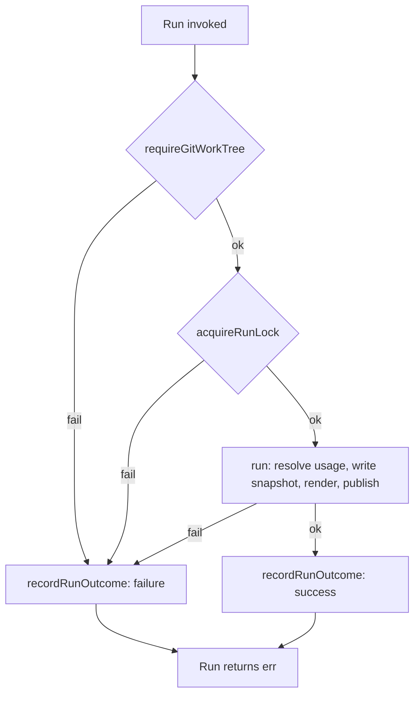

# Scheduled Run Status - Plan

## Goal Capsule

- **Objective:** Give an adopter a way to know whether their scheduled `token-profile run` is actually working — a `status` command reporting schedule registration state plus a rolling history of recent run outcomes.
- **Product authority:** Product Contract below (brainstorm dialogue, 2026-07-08; planning research, 2026-07-08).
- **Execution profile:** Strict TDD. The new run-history store is tested against a real temp directory (`t.TempDir()`), never a mocked filesystem — matching `internal/machineid`, `internal/config`, and `internal/snapshot`'s existing test conventions.
- **Open blockers:** None.

**Product Contract preservation:** unchanged from the brainstorm — no R-ID content or numbering changed. The brainstorm's "Deferred to Planning" outstanding questions are now resolved in Planning Contract's Key Technical Decisions below, so the Product Contract's Outstanding Questions section is removed.

---

## Product Contract

### Summary

`token-profile status` reports whether the schedule is currently registered and shows a rolling history of recent `run` invocations — timestamp, outcome, and error message on failure — giving an adopter one place to check whether their scheduled refresh is actually working.

### Problem Frame

Nothing in token-profile today persists what happened to a `run` invocation once it exits. Both scheduling mechanisms discard the process's output: the launchd plist has no `StandardOutPath`/`StandardErrorPath`, and the cron entry has no output redirection, so a scheduled failure produces no artifact anywhere. `CheckScheduleState` (`internal/cli/schedule.go`) only reports whether a schedule is *registered* — never whether its runs are succeeding. An adopter who registers a schedule and walks away has no way to notice a failing run short of manually re-running `token-profile run` and watching its output live.

### Key Decisions

- **Pull, not push.** A `status` command an adopter runs on demand, rather than a notification/alert delivered on failure — matches the CLI's existing pull-driven UX (`run`/`init`/`cleanup`) and avoids inventing a delivery mechanism this iteration.
- **Every invocation is recorded, not just scheduler-triggered ones.** `run` persists its own outcome regardless of what invoked it. Simplest to implement, though it means a manual debugging run and a genuine scheduled run are indistinguishable in the history (see Scope Boundaries).
- **Rolling history, not last-run-only.** A bounded number of recent records are retained rather than overwriting a single one, so `status` can show whether a failure was a one-off or a trend.
- **History is local to the machine that recorded it.** Unlike snapshots, run history is not merged across machines via git — on a multi-machine setup, an adopter checks `status` on each machine individually.

### Actors

- A1. Adopter — the human running `token-profile status` (and, interactively, `run`) on their own machine.
- A2. Unattended scheduler — cron/launchd invoking `token-profile run` with no TTY attached.

### Key Flows

F1. Recording a run's outcome

- **Trigger:** `token-profile run` reaches its end, successfully or with an error, invoked by A1 or A2.
- **Actors:** A1 or A2
- **Steps:** the run completes (or errors out, including before any refresh work starts); before exiting, it appends a record to the local run-history store; the store trims down to the retained count.
- **Outcome:** the run-history store reflects this invocation regardless of what triggered it or where it failed.
- **Covers:** R1, R2, R6

F2. Checking status

- **Trigger:** A1 runs `token-profile status`.
- **Actors:** A1
- **Steps:** resolve live schedule registration state; read the local run-history store; print both.
- **Outcome:** the adopter sees whether the schedule is registered and whether recent runs succeeded, without needing OS-level log access.
- **Covers:** R3, R4, R5

### Requirements

**Recording a run's outcome**

- R1. Every `token-profile run` invocation, on exit, appends a record (timestamp, outcome, and — on failure — the error message) to a local, bounded run-history store.
- R2. The run-history store retains only the most recent N records, automatically discarding older ones.
- R6. A failure to persist a run-history record never causes `run` itself to fail or changes its exit code.

**Reporting via status**

- R3. `token-profile status` prints the current schedule registration state (registered / not registered / check failed), reusing the existing schedule-state check.
- R4. `token-profile status` prints the run history, most recent first, showing each record's timestamp, outcome, and (for failures) the error message.
- R5. `status` reports a clear "no runs yet" state, without error, when no run has ever been recorded on this machine.

### Acceptance Examples

- AE1. Given no run has ever occurred on this machine, when the adopter runs `token-profile status`, then it prints the schedule registration state plus an explicit empty-history message, and exits 0. Covers R5.
- AE2. Given the run-history store is unwritable, when `token-profile run` otherwise completes successfully, then `run` still exits 0 and prints its normal success summary, surfacing the persistence failure as a non-fatal warning rather than a command failure. Covers R6.
- AE3. Given the store already holds N records, when another run completes, then `status` next shows N records with the oldest one dropped. Covers R2.

### Scope Boundaries

- Push notifications/alerts on failure — deferred; not part of this iteration.
- Merging or aggregating run history across multiple machines — local-only for now.
- Distinguishing manual from scheduler-triggered runs in the recorded history.
- Wiring launchd/cron to redirect raw stdout/stderr to a log file — superseded by the run-history store; no longer needed to answer this problem.

### Dependencies / Assumptions

- Reuses `CheckScheduleState` (`internal/cli/schedule.go:157`) as-is for the registration half of `status`.
- Assumes the run-history store lives alongside this project's existing local, unauthenticated machine state (`~/.token-profile/machine-id`, `~/.token-profile/config.json`) rather than inside any target repo — it is operational data, not something committed to a target repo's git history.

---

## Planning Contract

### Key Technical Decisions

- KTD1. **New `internal/runhistory` package for storage.** Mirrors `internal/snapshot`'s local-file read-merge-atomic-write shape (temp file in the same directory + `os.Rename`, `internal/snapshot/snapshot.go:147-170`) rather than folding read/append/trim logic into `internal/cli` — keeps `internal/cli` focused on cobra wiring and orchestration, consistent with how it already imports `internal/snapshot`, `internal/config`, and `internal/machineid` as separate packages.
- KTD2. **History path and schedule label stay machine-global constants, not `config.json` fields.** The schedule label (`launchdLabel`, `internal/cli/init.go:28`) is already a single hardcoded constant — this tool supports exactly one scheduled entry per machine, not one per target repo. The run-history path follows the same shape (`defaultStateFile("history.json")`, reusing the existing helper at `internal/cli/run.go:512-522`) rather than becoming a new `Config.HistoryPath` field. Consequence: `token-profile status` needs no `--config` flag at all — both halves of its output resolve from machine-global state, with no target repo in play.
- KTD3. **`Run`'s recording hook wraps the entire function, not just the inner pipeline.** `Run` (`internal/cli/run.go:105-117`) currently validates the git work tree and acquires the run-lock before delegating to the unexported `run` pipeline. Recording only `run`'s outcome would miss both preflight failures — exactly the silent-failure scenarios (target repo deleted, a stuck lock left by a crashed prior process) an adopter most needs `status` to surface. The hook instead wraps all of `Run`, via a named return plus a deferred call, so every exit path is recorded.
- KTD4. **Retained history count is a fixed package constant, not configurable.** `runhistory.DefaultLimit` (20) trades configurability for simplicity now — no current requirement to change it, and raising it later is a one-line, backward-compatible change (an existing shorter history just grows toward the new cap).
- KTD5. **`status` reports a live schedule-check failure as data, not a command failure.** When `CheckScheduleState` returns `ScheduleCheckFailed` (e.g. `launchctl`/`crontab` unreachable), `status` still exits 0 and prints "check failed" as the registration line — mirroring the existing precedent that a failed live-schedule check is reported as a warning, not a command failure (`docs/plans/2026-07-07-001-feat-guided-setup-teardown-plan.md`, KTD17).

### Assumptions

- Concurrent `Append` calls (e.g. two `token-profile run` invocations racing across different target repos on the same machine) are not additionally locked. The atomic temp-file-plus-rename write prevents a corrupted file, but the rarer race of one of two simultaneous appends being silently dropped is accepted — run history is diagnostic data, not the snapshot data multi-machine git-merges already protect, so losing one record under a rare double-invocation is low-stakes.
- `status` output formatting (exact line wording, date/time formatting) is left to implementation — presentation detail with no behavioral consequence.

### High-Level Technical Design

`Run`'s new outcome-recording hook, showing every exit path now captured (KTD3):



---

## Implementation Units

### U1. `internal/runhistory` package — record storage

- **Goal:** a local, bounded, atomically-written run-history store other packages can append to and read.
- **Requirements:** R1, R2, R6 (the store's contract; failure-tolerance in the caller is U2's job)
- **Dependencies:** none (new package)
- **Files:** `internal/runhistory/runhistory.go`, `internal/runhistory/runhistory_test.go`
- **Approach:** a `Record` type (`Timestamp time.Time`, `Success bool`, `Error string`) marshaled as a JSON array via `json.MarshalIndent` (matching `internal/config/config.go:300` and `internal/snapshot/snapshot.go:130`'s existing convention, trailing newline appended by hand). `Append(path string, rec Record) error` reads the existing array (a missing file is treated as empty, not an error), appends `rec`, trims to the oldest-dropped last `DefaultLimit` (KTD4) records, and writes back via the temp-file-in-same-directory-plus-`os.Rename` pattern from `internal/snapshot/snapshot.go:147-170` (`os.CreateTemp` → write → `Close` → `os.Chmod(0o644)` → `os.Rename`, with a deferred cleanup of the temp file on any error path). `Read(path string) ([]Record, error)` returns the stored records in the order written (oldest first); a missing file returns an empty slice and a nil error, not an error — the store has no opinion on display order, that's `status`'s job (R4).
- **Patterns to follow:** `internal/snapshot/snapshot.go`'s atomic-write and JSON-array persistence shape; `internal/config/config.go`'s `json.MarshalIndent` + trailing-newline convention.
- **Test scenarios:**
  - Happy path: `Append` to a path whose parent directory doesn't exist yet creates both the directory and the file; `Read` returns the one record.
  - Happy path — covers AE3: `Append` `DefaultLimit + 1` times; `Read` returns exactly `DefaultLimit` records with the oldest one dropped.
  - Edge case: `Read` on a path that has never been written returns an empty slice and a nil error (the data-layer half of R5's "no runs yet" contract).
  - Edge case: a `Success: true` record with an empty `Error` and a `Success: false` record with a populated `Error` both round-trip through `Append`/`Read` unchanged.
  - Error path: `Append` to a path whose parent directory can't be created (e.g. a plain file sitting where a directory component is expected) returns a non-nil error. (The "never fails the caller" contract from R6 is verified at the `internal/cli` layer in U2, not here — this package is allowed to fail loudly; its caller isn't.)
  - Integration: two sequential `Append` calls against the same path each read back what the previous call wrote, rather than one clobbering the other blind.
- **Verification:** `go test ./internal/runhistory/...` passes; `gofmt -l internal/runhistory` empty; `go vet ./internal/runhistory/...` clean.

### U2. Hook `Run` to record every invocation's outcome

- **Goal:** every `token-profile run` invocation — success, pipeline failure, or preflight failure — appends a record.
- **Requirements:** R1, R6; Covers F1
- **Dependencies:** U1
- **Files:** `internal/cli/run.go`, `internal/cli/run_test.go`
- **Approach:** add a `HistoryPath string` field to `RunDeps`, defaulted in `NewRunCmd` via `defaultStateFile("history.json")` (`internal/cli/run.go:512-522`) — no new flag, matching KTD2. Change `Run`'s signature to a named return (`err error`) and add `defer func() { recordRunOutcome(deps, err) }()` as its first statement, ahead of `requireGitWorkTree` and `acquireRunLock`, so every return path is captured (KTD3). Add an unexported `recordRunOutcome(deps RunDeps, err error)`: builds a `runhistory.Record` from `deps.Now` and `err`, calls `runhistory.Append`, and on a persistence error, best-effort-warns to `deps.Stdout` (nil-tolerant) without altering `err` — mirroring `writeSuccessSummary`'s existing "never fail run()" precedent (`internal/cli/run.go:170-193`).
- **Patterns to follow:** `writeSuccessSummary`'s best-effort-warn shape for `recordRunOutcome`; Go's named-return-plus-defer idiom for capturing every exit path of a function with multiple early returns.
- **Technical design (directional, not literal):**
  ```
  func Run(ctx context.Context, deps RunDeps) (err error) {
      defer func() { recordRunOutcome(deps, err) }()
      if err = requireGitWorkTree(ctx, deps.RepoDir); err != nil {
          return err
      }
      release, lockErr := acquireRunLock(deps.RepoDir)
      if lockErr != nil {
          err = lockErr
          return err
      }
      defer release()
      err = run(ctx, deps)
      return err
  }
  ```
- **Test scenarios:**
  - Happy path: a successful `Run` call appends exactly one `Success: true` record to `HistoryPath`.
  - Error path: the inner pipeline failing (e.g. an invalid `RepoDir` causing `snapshot.Write` to fail) appends a `Success: false` record whose `Error` contains the wrapped error text.
  - Error path: `requireGitWorkTree` failing (`RepoDir` isn't a git work tree) still appends a `Success: false` record — the preflight-failure case KTD3 exists for.
  - Error path: `acquireRunLock` failing (lock already held by a live PID) still appends a `Success: false` record.
  - Non-regression — covers AE2: pointing `HistoryPath` at an unwritable location does not change `Run`'s returned error on an otherwise-successful run; `Run` still returns `nil`.
- **Verification:** `go test ./internal/cli/... -run TestRun` passes, including the new history-recording cases; `go vet ./...` and `gofmt -l .` stay clean.

### U3. `status` command and registration

- **Goal:** `token-profile status` prints schedule registration state and recent run history, and is reachable from the built binary.
- **Requirements:** R3, R4, R5; Covers F2
- **Dependencies:** U1 (for `Read`); reuses `CheckScheduleState` (`internal/cli/schedule.go:157`) unchanged.
- **Files:** `internal/cli/status.go`, `internal/cli/status_test.go`, `cmd/token-profile/main.go`
- **Approach:** `NewStatusCmd()` mirrors `NewRunCmd`/`NewCleanupCmd`'s cobra-wrapper-delegates-to-exported-function shape, but takes no `--config` flag (KTD2). An exported `Status(ctx context.Context, deps StatusDeps) error` — `StatusDeps` holding `Schedule ScheduleDeps`, `HistoryPath string`, `Stdout io.Writer` — calls `CheckScheduleState(ctx, deps.Schedule)` and prints its `.String()` (`ScheduleState.String()`, `internal/cli/schedule.go:28-37`, already produces `"registered"`/`"not registered"`/`"check failed"`), always continuing regardless of the returned state (KTD5), then calls `runhistory.Read(deps.HistoryPath)` and either prints an explicit "no runs recorded yet" line (R5) or each record in reverse (most-recent-first, R4) with timestamp, outcome, and — for failures — the error text. `NewStatusCmd`'s `RunE` builds `StatusDeps{Schedule: ScheduleDeps{Label: launchdLabel}, HistoryPath: defaultStateFile("history.json"), Stdout: cmd.OutOrStdout()}` and calls `Status`. Register via `root.AddCommand(cli.NewStatusCmd())` in `cmd/token-profile/main.go`, alongside the existing three `AddCommand` calls.
- **Patterns to follow:** `NewRunCmd`/`NewCleanupCmd`'s cobra-wrapper-delegates-to-exported-function shape (`internal/cli/run.go:458-504`); `cmd/token-profile/main.go`'s one-line-per-command registration.
- **Test scenarios:**
  - Happy path: schedule registered plus two history records prints both the registration line and both records, most-recent-first.
  - Edge case — covers AE1: no history file present at all prints the explicit "no runs yet" message and `Status` returns `nil`.
  - Edge case: schedule not registered plus history present prints "not registered" alongside the history — the two facts are reported independently.
  - Edge case — covers KTD5: `CheckScheduleState` returning `ScheduleCheckFailed` prints "check failed" as the registration line and `Status` still returns `nil`.
  - Integration: a record with `Success: false` and a populated `Error` prints that error text verbatim, not a generic "failed".
- **Verification:** `go test ./internal/cli/... -run TestStatus` passes; `go build ./...` succeeds; manual smoke — `go run ./cmd/token-profile status` against a fresh `$HOME` prints the "no runs yet" plus "not registered" combination cleanly, and `token-profile status --help` shows the command.

---

## Verification Contract

| Command | Applies to | Gate |
|---|---|---|
| `go test ./...` | all units | must pass |
| `gofmt -l .` | all units | must be empty |
| `go vet ./...` | all units | must be clean |
| `go build ./...` | U3 | must succeed |
| `go run ./cmd/token-profile status` against a fresh `$HOME` | U3 | prints "no runs yet" + schedule state, exits 0 |

## Definition of Done

- U1, U2, and U3 are implemented with their listed test scenarios passing.
- `go test ./...`, `gofmt -l .`, and `go vet ./...` are all clean.
- `token-profile status --help` shows the command; running it against a fresh `$HOME` and against a machine with a registered schedule and recorded runs both produce correct, non-erroring output (manually verified).
- No leftover dead or experimental code from alternate approaches explored during implementation.

## Sources / Research

- `internal/cli/schedule.go:157` (`CheckScheduleState`), `:20-37` (`ScheduleState`), `:45-73` (`ScheduleDeps`) — the registration-state check `status` reuses as-is.
- `internal/cli/schedule.go:245` (`launchdPlist`) and `:384` (`cronJobLine`) — confirm neither scheduling mechanism currently captures a run's output.
- `internal/cli/init.go:28` (`launchdLabel`) — the single machine-global schedule-label constant `status` reads directly (KTD2).
- `internal/cli/run.go:62-117` (`RunDeps`, `Run`) and `:170-193` (`writeSuccessSummary`) — the exact hook point and best-effort-warn precedent for U2.
- `internal/cli/run.go:506-522` (`defaultConfigPath`, `defaultStateFile`) — the existing local-state-path convention U1/U2/U3 all reuse.
- `internal/config/config.go:73-100` (`Config`), `:296-332` (`WriteTemplate`, `defaultMachineIDPath`) — the config-field-vs-machine-global-constant precedent behind KTD2.
- `internal/snapshot/snapshot.go:115-170, 205-215` — the atomic-write and JSON-array persistence shape `internal/runhistory` reuses (KTD1).
- `internal/cli/lock.go:20-22` — `acquireRunLock` is scoped to a target repo, not machine-global state, confirming it's the wrong lock to reuse for the history store (see Planning Contract Assumptions).
- `docs/plans/2026-07-07-001-feat-guided-setup-teardown-plan.md`, KTD17 — the "failed live-check is a warning, not a command failure" precedent behind KTD5.
